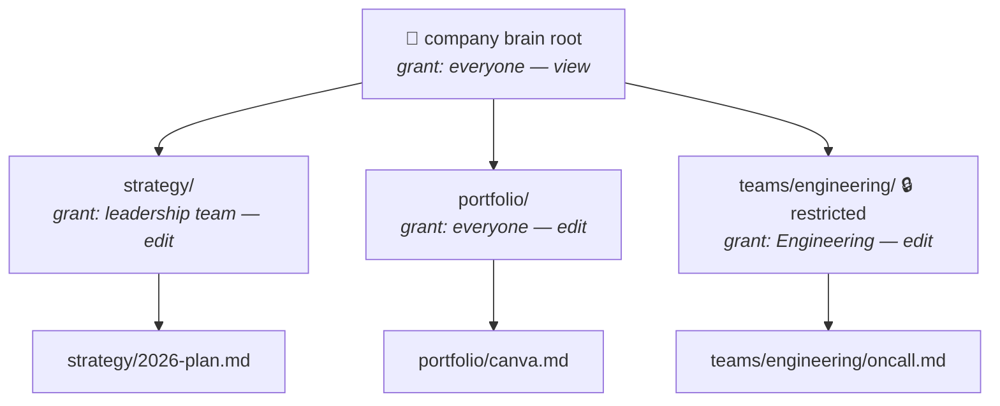
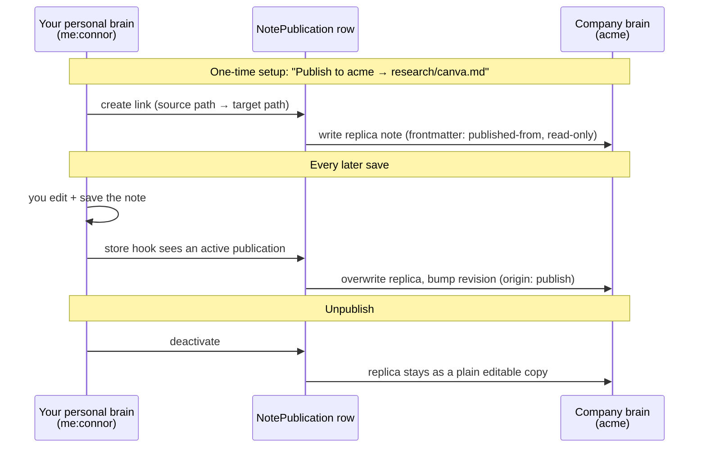

# Multiplayer brains: one permission system for personal, company, and team context

*Visvine architecture proposal — July 2026*

How access to notes, folders, and whole brains should work when people join your community, when teams need their own space inside a company brain, and when you want to sync context from your personal brain into a company brain — designed to extend what's already built, not replace it.

## Contents

1. [The whole system in one paragraph](#1-the-whole-system-in-one-paragraph)
2. [What already exists (more than you think)](#2-what-already-exists-more-than-you-think)
3. [What the best systems teach](#3-what-the-best-systems-teach)
4. [The five rules](#4-the-five-rules)
5. [The access model](#5-the-access-model)
6. [Teams and team subtrees](#6-teams-and-team-subtrees)
7. [Syncing between brains (publish)](#7-syncing-between-brains-publish-dont-reference)
8. [Database changes](#8-database-changes)
9. [Managing it: the Share panel](#9-managing-it-the-share-panel)
10. [Rollout in three phases](#10-rollout-in-three-phases)
11. [Edge cases, answered](#11-edge-cases-answered)

---

## 1. The whole system in one paragraph

Every brain is a folder tree, and **access flows down the tree**: a grant on a folder covers everything inside it. Grants can go to a **person**, a **team**, or **everyone in the community**, at one of four levels (view → comment → edit → full). Your effective access to any note is simply **the strongest grant that reaches it** — grants only ever add, never subtract, so "why can Alice see this?" always has a one-line answer. Privacy is structural, not rule-based: a folder marked **restricted** cuts off inheritance from above and starts fresh, which is how team-only subtrees work inside a company brain. Moving context between brains is never a live cross-tenant read — it's **publish**: the note stays yours in your personal brain, and a synced replica lives as a real note in the company brain, updated whenever you save.

## 2. What already exists (more than you think)

I mapped the codebase before designing anything, and the good news is that Visvine already has about half of this system — it just lives in a JSON sidecar file instead of proper tables, and only understands folders and individual users.

| Already built | Where | Keep / change |
|---|---|---|
| Folder-level access levels (`read` / `write` / `admin`) with public/private visibility, per top-level folder | `lib/notes/registry.ts`, stored in the `folders.json` sidecar (`CommunityBrainFile`) | **Keep the semantics, promote to a real table** so grants are queryable and can target teams |
| The "brain gate": community brains are private by default; a root registry entry gates the whole brain and grandfathers members on first touch | `ensureBrainGate` in `registry.ts` | Keep — this becomes the root-folder grant row |
| Visibility lens: unreadable notes are filtered out *before* the index, graph, search, and backlinks are built, so titles never leak | `lib/notes/shared/visibility.ts`, `vaultView.ts` | Keep unchanged — this is exactly the right architecture and the reason nothing leaks into search or the graph |
| Personal spaces: every user has a `me:userId` community whose shared brain is their personal brain; `personalOwnerId` hard-isolates it | `lib/onboarding/personalCommunity.ts`, `lib/communities/personalSpace.ts` | Keep — personal brains stay owner-only and never folder-gated |
| Promote: one-time copy of a note from personal brain → community brain, with provenance and a proposal queue when you can't write the destination | `lib/notes/promote.ts` | Keep as "publish a copy"; extend into live publish (§7) |
| Audited reads of private folders, join requests for private folders | `brainService.ts`, `joinRequests.ts` | Keep; audit gets richer once grants are rows |

What's **missing**: teams as a grantable unit, grants at any folder depth (today it's top-level folders only), note-level exceptions, a way to *restrict* a subtree inside an open area, live sync between brains, and a single UI that answers "who can see this and why."

## 3. What the best systems teach

I researched how the major products solve exactly this problem. They disagree on details but converge hard on a few things.

| System | Core idea | Lesson for Visvine |
|---|---|---|
| **Notion** | Workspace → teamspaces → pages; subpages inherit; **broadest access wins** (purely additive); privacy via private teamspaces, not deny rules; one Share dialog with "via Engineering" provenance chips | Copy the additive model and the provenance UI almost verbatim — it's the most manageable model in production anywhere |
| **Google Drive** | My Drive allows per-file overrides in both directions; Shared Drives only allow widening below the top | A cautionary tale: per-item overrides that can *narrow* produce un-auditable Swiss cheese and "why can't I see this" tickets. Don't build deny rules |
| **Confluence** | Space permissions, then page restrictions that **only narrow, never widen** | Restriction as a structural cut (our "restricted folder"), not per-person denies |
| **Google Zanzibar** (SpiceDB / OpenFGA) | All access as relation tuples + inheritance rules; hierarchy is one parent pointer, not copied ACLs | Adopt the *shape* — a grants table + tree inheritance — but implement it in your existing Postgres. Running a separate authz service at Visvine's scale means dual-writing every change for zero benefit; a team that tried (Rover) ripped it out and rebuilt in plain Postgres |
| **Slack / Linear** | Almost no per-object ACLs; the *container* (channel, private team) is the access boundary | Containers first: most sharing questions should be answered by "which folder is it in," with grants as the exception |
| **Obsidian / Anytype** | Whole vault/space is the sharing unit; no fine-grained ACLs at all | Validates that coarse sharing covers most collaboration — fine-grained control is opt-in complexity, so default UX should stay simple |

## 4. The five rules

Every decision below follows from these. If a future feature would break one, that's the signal to redesign the feature.

1. **Access only adds.** Your effective level on a note is the *maximum* across everything that applies to you. There are no deny rules, ever. This is what keeps the system explainable.
2. **Privacy is a place, not a rule.** To hide something, you put it in (or mark it as) a restricted folder — you never subtract a person from an open one. Restriction cuts inheritance and starts a fresh boundary.
3. **Grants live on folders by default.** Note-level grants exist but are the rare exception. Ninety percent of management should be "this subtree belongs to this team."
4. **Notes never cross tenant boundaries at read time.** Sharing between brains is publish-and-replicate — the receiving brain gets a real note row it owns. No API read path ever resolves into a foreign community. (This is the same principle as the `personalOwnerId` leak fix, kept sacred.)
5. **Every answer is auditable in one query.** "Who can see this?" = list the grants whose folder contains it. "Why can Alice?" = show the one winning grant with its source. If a design makes that answer require reasoning, it's wrong.

## 5. The access model

### Four levels, strictly ordered

Replacing today's three registry levels with four, matching what people expect from Notion/Docs. Levels are just integers, so "does edit imply view?" is a comparison, not a rule.

| Level | Means |
|---|---|
| **view** | read the note, see it in graph & search |
| **comment** | view + discuss (future-proofing) |
| **edit** | comment + write, create, move within |
| **full** | edit + share, restrict, delete the subtree |

### Who can hold a grant

A grant is one row: *subject* gets *level* on *resource*. Three subject kinds cover every case without special code paths:

- **a. Community** *(exists today)* — "Everyone in this community" — the default grant on the brain root. This is exactly today's brain gate, expressed as a row.
- **b. Team** *(new)* — A named group inside a community (Engineering, GTM, Board). One grant row gives a whole team access to a subtree; joining the team is joining everything it can see.
- **c. Person** *(exists today)* — A direct grant to one member — today's per-user registry entries. Still supported, but the UI nudges toward teams.

### How a check works

Notes already carry their full folder path (`portfolio/deals/canva.md`), which means the tree is already materialized — no schema gymnastics needed. To compute someone's access to a note:

1. Collect their grant set once per request: community-wide grants + their teams' grants + their direct grants. This is a handful of rows.
2. A grant *reaches* the note if its folder is an ancestor of the note's path (or the note itself) — a path-prefix comparison.
3. **Restricted folders cut the beam.** If any folder between the grant and the note is marked restricted, grants from above the cut don't reach past it; only grants on or inside the restricted folder count.
4. Effective level = the max of everything that reached. Community admins and super admins bypass, as today.



Reading that example: every member can *view* `strategy/2026-plan.md` (root grant flows down) and leadership can edit it. Everyone can edit portfolio notes. But `oncall.md` is invisible to non-engineers — the 🔒 on `teams/engineering/` stops the root "everyone — view" grant at the boundary, and only the Engineering team grant operates inside. That one mechanism is the entire answer to "company-wide top-level context plus team-specific notes."

### Performance: no per-note checks in lists

The trap in every ACL system is checking notes one at a time when rendering a list, search result, or graph. The design avoids it the same way the current visibility lens does: fetch the user's grant set once (a few rows), reduce it to a list of "readable subtree roots minus restricted cuts," then filter the whole vault in one pass with path-prefix matching. The existing `filterVisible` → index → graph → search pipeline keeps working unchanged — only the function that decides "can this principal read this path" gets smarter.

## 6. Teams and team subtrees

Teams are deliberately boring: a name, a community, members, optional team leads who manage membership. They are **not** a permission concept by themselves — they're a subject you can put in a grant, which keeps them reusable for future features (mentions, channels, event invites) without entangling those with access control.

The recommended convention for a company brain:

```
acme company brain
├── handbook/           everyone: view · ops team: edit
├── strategy/           everyone: view · leadership: edit
├── portfolio/          everyone: edit
├── people/  companies/ entity context notes — follow root grant, as today
└── teams/
    ├── engineering/ 🔒  Engineering: edit — invisible to others
    ├── gtm/         🔒  GTM: edit
    └── board/       🔒  Board: full — the sensitive one
```

Two nice properties fall out for free. **Onboarding is one action:** add someone to the Engineering team and they instantly see the handbook, strategy, portfolio, and the engineering subtree — nothing per-folder to remember. **Offboarding is the same action reversed**, and because access is computed live from grants, there's no cleanup job that can miss something.

> **Design choice:** A restricted folder's *name* can optionally be listed for non-members (like seeing a locked channel in Slack) with a "request to join" action — this reuses the existing join-requests machinery. Default: fully hidden, matching today's private-folder behavior.

## 7. Syncing between brains: publish, don't reference

The question "I keep context in my personal brain — how do I sync it to my company brain?" has three possible answers, and only one survives contact with the codebase:

| Option | How it works | Verdict |
|---|---|---|
| **Copy** | Duplicate the note across (today's promote) | Fine, but diverges the moment you edit — keeps being a papercut |
| **Reference** | Company brain stores a pointer; reads resolve into your personal community | **Rejected.** Every read path — search, graph, backlinks, embeddings, mobile — would need cross-tenant logic. This is precisely the leak class the `personalOwnerId` guard exists to prevent |
| **Publish** | Source of truth stays in your brain; a live replica exists as a *real note row* in the company brain, refreshed on every save | **Recommended.** The replica is community-owned data, so every existing system — visibility lens, search, [[mention]] link sync, graph, mobile API — works on it with zero changes |



The rules that keep it sane:

- **One-way, by design.** The replica is read-only in the destination (its editor shows "Published from Connor's brain — suggest a change or unlink"). Two-way sync is a merge-conflict project with little payoff; if the team needs to own the note, they unlink it and it becomes a normal copy.
- **Publishing requires edit rights at the destination folder** — otherwise it queues through the existing move-proposal approval, same as promote today.
- **Access is governed entirely by the destination.** Once published into `research/`, whoever can read `research/` can read the replica. Your personal grants never leak across; unpublishing or deleting the source deactivates the replica (kept as a copy, clearly marked stale).
- **[[Mentions]] re-resolve per brain.** The replica's entity mentions sync links into the *company's* directory graph via the existing `syncContextLinks` hook — which is exactly what you want: publishing context enriches the company graph.
- Works community-to-community too (e.g. your VC community brain → a portfolio company's brain) with the same mechanism — personal → company is just the common case.

> **Why this is safe:** No read path ever crosses a community boundary. The only cross-tenant motion is a *write*, at save time, through one choke point that stamps provenance and respects destination permissions. One function to secure, one function to audit.

## 8. Database changes

Four new tables, no changes to how notes are stored. Grants migrate out of the `folders.json` sidecar (a one-time script reads every registry and writes rows; the sidecar stays during transition as a fallback).

```prisma
model Team {
  id           String   // cuid
  communityId  String
  name         String
  members      TeamMember[]   // userId + role: lead | member
}

model BrainGrant {
  id           String
  communityId  String         // which brain (ownerKey stays 'shared')
  subjectType  String         // 'community' | 'team' | 'user'
  subjectId    String         // '' | teamId | userId
  resourcePath String         // '' = brain root, 'teams/engineering', or a note path
  level        Int            // 10 view · 20 comment · 30 edit · 40 full
  grantedBy    String
  createdAt    DateTime
  // unique: [communityId, subjectType, subjectId, resourcePath]
}

// restricted flag lives on the existing CommunityNoteFolder:
model CommunityNoteFolder { // ... existing fields ...
  restricted   Boolean  @default(false)   // cuts inheritance at this folder
}

model NotePublication {
  id                String
  sourceCommunityId String    // e.g. me:connor
  sourcePath        String
  targetCommunityId String
  targetPath        String
  active            Boolean   // false after unlink → replica becomes a copy
  lastSyncedAt      DateTime
  createdBy         String
}
```

And one new seam in code, mirroring how `featureAccess.ts` isolated feature logic: `lib/notes/authz.ts` exporting pure functions — `effectiveLevel(grants, teams, path, restrictedFolders)` and `readableRoots(...)` — with the existing `principalCanRead`/`principalCanWrite` predicates reimplemented on top. Pure functions mean the whole model is unit-testable without a database, in the same style as the current permissions tests.

## 9. Managing it: the Share panel

The model above only pays off if the UI makes it self-explanatory. One panel, reachable from any folder or note, three sections:

- **Who has access** — the computed, merged list. Every row shows the person or team, their effective level, and a provenance chip: *"via Engineering team on teams/engineering/"*, *"everyone in Acme"*, *"direct grant"*. This list *is* the audit — no separate tool needed.
- **Change access** — add a team or person at a level; toggle **Restrict this folder** (with a plain-language confirm: "Only people granted here will see inside. 14 members will lose access."). A "restore inherited" action deletes local grants and un-restricts — one click back to a clean state.
- **Published copies** — on a source note: where it's published, last synced, unlink. On a replica: "Published from Connor's brain", jump to source if you have access.

Plus two ambient affordances: a small 🔒 on restricted folders in the tree (so the boundary is visible where people navigate), and a per-brain "Access overview" page for admins listing every restricted folder and every grant — the Confluence lesson that forgotten restrictions are the #1 support ticket.

## 10. Rollout in three phases

Each phase ships alone, is useful alone, and none is invalidated by the next — the additive model guarantees later phases only add capability.

### Phase 1 — Formalize *(grants become rows; behavior identical)*

- Add `BrainGrant`; migrate `folders.json` registries into it; reimplement `principalCanRead/Write` over `lib/notes/authz.ts`
- Map old levels (read/write/admin → view/edit/full); brain gate becomes the root community grant
- Ship the Share panel in read-only form ("who has access + why")
- Risk: lowest — a refactor with a behavior-parity test suite, no product change

### Phase 2 — Teams & restriction *(the multiplayer core)*

- Add `Team`/`TeamMember` + console management; teams become grantable subjects in the Share panel
- Add the `restricted` folder flag + inheritance cut in `authz.ts`; grants now work at any folder depth, not just top-level
- Wire join-requests to restricted folders; admin Access overview page

### Phase 3 — Publish *(cross-brain sync)*

- Add `NotePublication` + the save-hook replicator (extends the existing `syncContextLinks` hook point in `store.ts`)
- "Publish to…" UI on personal-brain notes; replica read-only banner + unlink; promote becomes "publish once (no sync)"
- Optional later: note-level direct grants and expiring share links — the schema already supports both (a grant with a note path; a token table), so they're additions, not redesigns

## 11. Edge cases, answered

**Someone joins the community — what do they see?**
Whatever the root community grant says (default: view), minus every restricted subtree. Nothing per-person to configure; add them to teams to open more. No more grandfathering-at-first-touch — membership changes take effect immediately because access is computed, not materialized.

**Someone leaves the community or a team?**
Their community/team grants stop matching instantly. Direct grants to them in that community are deleted with membership. Nothing to sweep.

**A note moves into a restricted folder?**
It immediately adopts the destination's access — path is the single source of truth, so a move *is* a permission change. The move UI warns when a move would widen or narrow the audience ("this note will become visible to everyone in Acme"). The existing `moveGated` already checks both ends; it keeps doing so.

**Links pointing into a folder I can't read?**
Exactly as today: the visibility lens runs before link resolution, so the link renders as unresolved — no title leak, in graph, backlinks, or search.

**What about the entity context notes (people/, companies/)?**
They follow the same rules — they're just notes in folders. If a community wants member profiles readable by all but editable by admins, that's one grant pair on `people/`. Restricting them also hides the corresponding context tabs, consistently, because profile tabs read through the same lens.

**Does the published replica leak my personal edits history?**
No — the replica gets its own revision history in the destination (origin `publish`), starting from the first published version. Your personal revision trail never crosses.

**Mobile?**
No client changes. Filtering is entirely server-side (the lens), so clients can never receive rows the user can't see — which also keeps any future offline cache safe by construction.

**Why not SpiceDB / OpenFGA?**
Their model is right and this design borrows it (grants ≈ tuples, inheritance ≈ parent rewrites). But a separate authorization service means dual-writing every membership and folder change and mirroring deletes — real operational cost, zero benefit at single-Postgres scale. The four-table version gives the same expressiveness inside your existing transaction boundary, and if Visvine ever needs Zanzibar-scale, the grant rows translate one-to-one into tuples.

---

*Sources behind §3: Notion sharing & teamspaces docs · Google Drive / Shared Drives help & known-issues threads · Atlassian Confluence permissions docs · AuthZed's annotated Zanzibar paper · Rover's "OpenFGA in pure Postgres" write-up · WorkOS multi-tenant permissions analysis (Slack/Notion/Linear) · Obsidian & Anytype collaboration docs. Codebase references verified against the working tree on 2026-07-24.*
