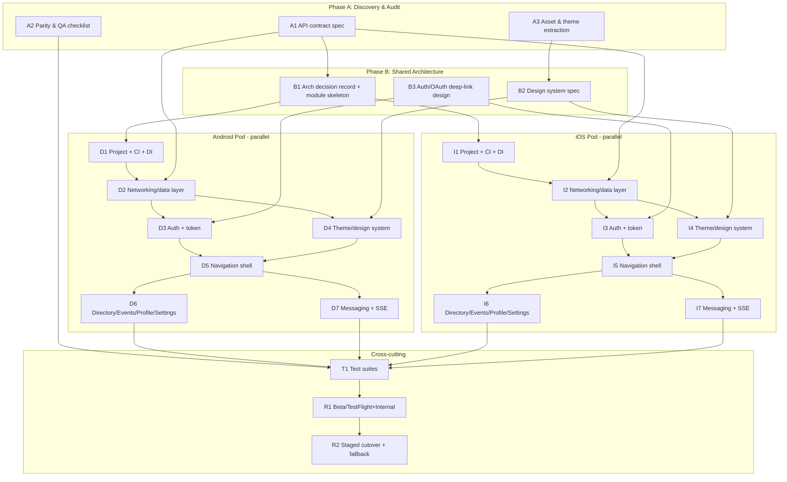

# Visvine Mobile — React Native → Native (Kotlin/Swift) Migration Strategy

> **Status:** Proposed · **Owner:** Mobile platform · **Last updated:** 2026-05-30
>
> This document is the migration strategy. It describes *what* we will build and *in what order*; it
> introduces **no application code changes**. All scope figures in this document were verified against
> the codebase (see [Appendix A — Grounding](#appendix-a--grounding)).

## Context

`@visvine/mobile` is an **Expo managed** React Native app (SDK 54, RN 0.81.5, React 19, New
Architecture on) that ships the Visvine community platform to iOS and Android. We are migrating it to
**fully native** apps — **Kotlin/Jetpack Compose** on Android, **Swift/SwiftUI** on iOS — to shed the
JS bridge, get first-class platform performance/tooling, and unlock native capabilities (push,
real-time, offline) the Expo layer currently makes awkward.

The single most important fact shaping this plan, confirmed by reading the code: **the mobile app is a
thin client.** Essentially all business logic lives server-side in the `@visvine/web` Next.js backend
(`apps/web/app/api/**`), which **stays unchanged** and remains the source of truth for both the new
native apps and the web app. The client's own logic is small and well-contained:

| Concern | Where it lives today | Port target |
|---|---|---|
| API access (12 methods over ~9 endpoints, Bearer token, media-URL resolution) | `src/services/api.ts` (one `ApiService` class) | Kotlin/Swift networking client |
| Auth (Google OAuth via web browser, deep-link `visvine://auth/callback?token=`, token in SecureStore) | `src/contexts/AuthContext.tsx`, `src/screens/Auth/LoginScreen.tsx` | Custom Tabs / ASWebAuthenticationSession + Keystore/Keychain |
| App state (4 React Contexts: Auth, Community, Theme, Search) | `src/contexts/*` | ViewModels + DataStore/UserDefaults |
| Theming (8 color themes + a global light/dark toggle, persisted) | `src/contexts/ThemeContext.tsx`, `src/theme/*` | Compose Theme / SwiftUI Environment |
| Navigation (auth/main switch → bottom tabs → per-tab stacks, 11 screens) | `src/navigation/*` | Navigation-Compose / SwiftUI NavigationStack |

**Decisions locked with stakeholder:**
- **Strategy: Big bang.** Build both native apps in parallel to full feature parity against the
  existing backend, freeze net-new RN feature work, then cut over in a single coordinated store
  release. Fastest path to clean architecture; the safety net is that the **existing Expo app stays
  live in the stores until cutover**, plus a **staged store rollout** (1%→100%) at the swap.
- **Staffing: iOS + Android in parallel.** Two platform pods build concurrently off a shared
  architecture + API-contract spec; a Shared Architecture owner and a QA lead span both.

---

## Executive Summary

Visvine mobile is a thin client over a stable REST + SSE backend, which makes a big-bang native
rebuild unusually low-risk for a big bang: there is **no business logic to reverse-engineer**, **no
local database/offline sync** today, and **no heavy native modules** (no maps, camera, or custom
bridges). The work is (1) re-implementing **11 screens** and **4 context-stores** natively, (2)
re-creating the OAuth deep-link flow and token storage on each platform, and (3) re-pointing at the
same backend via a generated API contract (**12 `ApiService` methods across ~9 distinct endpoints**).
We run **two platform pods in parallel** behind a **shared architecture + API-contract phase** that
must land first so both pods build against one agreed spec. Recommended architecture is **MVVM + a thin
repository/data layer** on both platforms (Compose + Kotlin Coroutines/Flow on Android; SwiftUI +
async/await on iOS) — deliberately matching the existing Context→Service shape so porting is
mechanical, not a redesign. Rough order-of-magnitude timeline with one iOS lead + one Android lead +
shared architect + QA: **~12–16 weeks** to parity and staged cutover, dominated by the messaging and
profile surfaces. The primary risk for a big bang — "two apps, neither shippable for months" — is
mitigated by keeping the Expo app in stores as the live fallback and gating cutover on a parity
checklist + staged rollout with a documented roll-back-to-Expo procedure.

---

## Phase 1 — Research Findings (grounded in the codebase)

### Domain 1 — Current RN codebase

- **Structure:** Expo managed monorepo app (`apps/mobile`), pnpm workspace, shares `@visvine/types`.
  No `ios/`/`android/` native dirs (managed workflow → config via `app.json`, scheme `visvine`,
  bundle id `com.visvine.mobile`).
- **State management:** **React Context API only** — no Redux/MobX/Zustand. Providers nested in
  `App.tsx`: `SafeAreaProvider` → `ThemeProvider` → `AuthProvider` → `CommunityProvider` →
  `AppNavigator`. There are **4 context modules** under `src/contexts/`, but only **3 are mounted in
  `App.tsx`**; `SearchProvider` is mounted lower in the tree (confirm its exact mount point during the
  port). Each is a small `useState`/`useEffect` store. This maps 1:1 to ViewModels; **no global state
  library to replicate.**
- **Dependencies (all light):** `expo-secure-store` (token + theme persistence), `expo-web-browser` +
  `expo-auth-session` (OAuth), `expo-linking` (deep links), `expo-crypto`, `expo-blur`, `expo-font`,
  `@expo/vector-icons` (Ionicons), `@react-navigation/*` v7, `react-native-screens`,
  `react-native-safe-area-context`. **Every one has a first-party native equivalent** (table in Domain
  2). No mapping/camera/payments/native bridges to port, and **no local database / offline-sync
  library**.
- **Feature inventory (11 screens):**
  - **Auth (2):** `LoginScreen` (OAuth), `DevLoginScreen`.
  - **Directory (1):** `DirectoryScreen` (member grid + search overlay).
  - **Events (2):** `EventsListScreen`, `EventDetailScreen` — `location` carries lat/lon but **no map
    is rendered**.
  - **Messaging (2):** `ConversationsListScreen`, `ConversationScreen` (thread).
  - **Profile (3):** `ProfileScreen`, `FullProfileScreen`, `EditProfileScreen`.
  - **Settings (1):** `SettingsScreen` (theme / dark-mode / logout).

  **Most complex surface: Messaging** (pagination cursor, optimistic send, and a *latent* real-time
  gap). **Next: Profile/Directory** (node vs. profile type reconciliation in `src/types/index.ts`).
- **API layer:** single `ApiService` in `src/services/api.ts` — plain `fetch`, `Authorization: Bearer`,
  a `{data?, error?}` envelope, and a `resolveMediaUrl` helper that rewrites relative media paths
  against `API_BASE`. **12 methods** — `getSession`, `getCommunities`, `getCommunity`, `getEvents`,
  `getEvent`, `getConversations`, `getMessages`, `sendMessage`, `getDirectoryMembers`, `getProfile`,
  `getFullProfile`, `updateProfile` — hitting **~9 distinct backend routes** (`getProfile` and
  `getFullProfile` both call `/api/profile/[personId]`). This is the **entire** client contract to
  port.
- **Shared/business logic:** minimal and client-side-only — token lifecycle, `resolveMediaUrl`, theme
  color derivation (`buildColors`), deep-link parsing/route mapping in `AuthContext`. The real
  business logic is server-side and untouched.
- **iOS/Android code reuse today:** 100% shared (it's RN). After migration, sharing is via the **API
  contract + design system + shared `@visvine/types` as the contract source**, not shared code.
- **Performance / tech debt:** No known perf hotspots (thin client). Debt to *not* carry over:
  duplicated `Event`/`User` types in `src/types/index.ts` vs `@visvine/types`; `AppNavigator`'s
  `setTimeout(0)` deep-link navigation hack; messaging not wired to the existing SSE stream.
- **Testing:** Jest, **logic-only** (node env), a **single** test file (`api.test.ts` covering
  `resolveMediaUrl`). No component/UI/integration tests. Effectively a green-field test surface.

### Domain 2 — Target native stack (2024–2025 best practice)

**Architecture (both platforms): MVVM + thin Repository/data layer + DI.** Chosen because it mirrors
the existing Context(=ViewModel)→Service(=Repository) shape, so porting is mechanical. (MVI is viable
but adds redesign cost with no payoff for a thin client.)

| Concern | Android (Kotlin) | iOS (Swift) |
|---|---|---|
| UI | Jetpack Compose + Material 3 | SwiftUI |
| Navigation | Navigation-Compose | NavigationStack (iOS 16+) |
| Async/state | Coroutines + Flow / StateFlow | async/await + `@Observable` |
| Networking | Retrofit + OkHttp + kotlinx.serialization | URLSession + Codable (or Alamofire) |
| DI | Hilt | Manual / Factory / swift-dependencies |
| Secure token | EncryptedSharedPreferences / Keystore | Keychain |
| Prefs (theme/dark) | DataStore | UserDefaults |
| OAuth | Custom Tabs + AppAuth (or `androidx.browser`) | ASWebAuthenticationSession |
| Deep links | App Links / `visvine://` intent filter | Universal Links / `visvine://` URL scheme |
| Images | Coil | Kingfisher / AsyncImage |
| Real-time (SSE) | OkHttp-EventSource | URLSession bytes / EventSource lib |
| Local DB (future offline) | Room | SwiftData / GRDB |
| Build/dep mgmt | Gradle (KTS) + Version Catalog | Xcode + Swift Package Manager |
| Unit test | JUnit5 + Turbine + MockK | XCTest / Swift Testing |
| UI test | Compose UI Test / Espresso | XCUITest |
| Profiling | Android Studio Profiler, Macrobenchmark | Instruments |
| Crash/analytics | (match web stack — Sentry/Firebase) | (same) |
| CI/CD | GitHub Actions + Gradle, Play Internal track + Fastlane | GitHub Actions + Xcode Cloud / Fastlane, TestFlight |

**Dependency → native equivalent (gaps):** every current dependency maps cleanly (table above). The
only "gap" is not a dependency but a **latent feature**: messaging real-time. The backend already
exposes SSE at `/api/messages/stream` (emits `message.new` / `conversation.updated`, keepalive every
20s); build native SSE consumers (no server change needed).

### Domain 3 — Strategy evaluation (selected: Big bang)

| Strategy | Timeline | Risk / failure mode | Team | Roll-back point |
|---|---|---|---|---|
| **Big bang (SELECTED)** | ~12–16 wks | "Two apps, nothing shippable for months"; parity gaps surface late | iOS lead + Android lead + shared architect + QA, in parallel | Keep Expo app live in stores until cutover; staged store rollout (1%→100%); revert release if crash/parity regressions |
| Incremental brownfield | ~20–28 wks | Eject Expo → bare/dev-client; RN+native bridge complexity carried throughout | + RN engineer to maintain hybrid | Per-screen flags |
| Feature-flag / staged | ~16–22 wks | Maintain two code paths in parallel | larger | Per-feature |

**Why big bang fits here:** the usual big-bang killer is reverse-engineering undocumented client
business logic — which **does not exist** in this thin client. Parity scope is a finite, readable list
(11 screens, 12 client methods over ~9 endpoints). The Expo app staying in stores removes the "no
fallback" failure mode that normally makes big bang dangerous, so we get the clean-architecture and
speed upside without the classic downside.

---

## Phase 2 — Migration Plan (phased tasks, owners, dependencies)

### Dependency / parallelism shape

The critical path is **A1 (API contract) → B1/B2/B3 (shared design) → pod data layers → screens → test
→ cutover.** Everything inside the Android and iOS subgraphs runs **fully in parallel** between the two
pods; the shared phases A and B are the bottleneck both pods wait on, so they are front-loaded and
time-boxed.

### Phase A — Discovery & Audit (unblocks everything; ~1 week)

| ID | Task | Effort | Owner | Depends on | Deliverable | Parallel? |
|---|---|---|---|---|---|---|
| A1 | **API contract spec.** Document the 12 methods `ApiService` calls (path, params, request/response shape, the `{data,error}` envelope, Bearer header, `resolveMediaUrl` rules) by reading `src/services/api.ts` + the `apps/web/app/api/**/route.ts` handlers. Capture as OpenAPI or a typed contract sourced from `@visvine/types`. | 3–5 d | Shared Architecture | None | API contract doc / OpenAPI | Yes (with A2,A3) |
| A2 | **Parity & QA checklist.** Enumerate every screen, state, empty/error/loading case, and the OAuth + deep-link flows as the definition-of-done for cutover. | 1–3 d | QA Lead | None | Parity checklist | Yes |
| A3 | **Asset & theme extraction.** Pull the 8 color themes + the global light/dark token sets from `ThemeContext.tsx`/`theme/colors.ts`, brand colors, Ionicons usage, fonts (`expo-font`) into a platform-neutral design-token table. | 1–2 d | Shared Architecture | None | Design tokens doc | Yes |

### Phase B — Architecture Design (shared; both pods wait on this; ~1 week)

| ID | Task | Effort | Owner | Depends on | Deliverable | Parallel? |
|---|---|---|---|---|---|---|
| B1 | **Architecture Decision Record + module skeleton.** Lock MVVM + repository + DI; define layer boundaries (UI / ViewModel / Repository / Networking) and the cross-platform naming so screens line up 1:1. | 2–4 d | Shared Architecture | A1 | ADR + diagrams | Feeds both pods |
| B2 | **Design system spec.** Map tokens (A3) to Compose `Theme`/Material3 and SwiftUI environment; component inventory (avatar, screen header, loading, search overlay, message bubble, member card). | 2–4 d | Shared Architecture (+ both leads review) | A3 | Design system spec | Feeds both pods |
| B3 | **Auth / OAuth deep-link design.** Specify the native equivalent of the `expo-web-browser` flow: Custom Tabs/ASWebAuthenticationSession → `${API_URL}/api/auth/callback/google-mobile` → `visvine://auth/callback?token=` → token to Keystore/Keychain → `getSession`. Define App Links/Universal Links + the `visvine://` scheme registration. | 2–3 d | Shared Architecture | A1 | Auth flow spec | Feeds both pods |

### Phase C — Android Native Build (Kotlin) — runs in parallel with iOS

| ID | Task | Effort | Owner | Depends on | Deliverable | Parallel? |
|---|---|---|---|---|---|---|
| D1 | Project bootstrap: Gradle KTS + version catalog, Hilt, Compose, modules per ADR, GitHub Actions CI (build+lint+unit), Play **Internal** track wiring. | 3–7 d | Android Lead | B1 | Buildable skeleton + CI | ∥ iOS I1 |
| D2 | **Data layer:** Retrofit/OkHttp client, kotlinx.serialization models from A1 contract, `Authorization` interceptor, `Result`-style envelope mirroring `{data,error}`, `resolveMediaUrl` port + unit test. | 1–2 wk | Android Lead | D1, A1 | Networking + repositories | ∥ iOS I2 |
| D3 | **Auth + token:** OAuth via Custom Tabs/AppAuth per B3, deep-link intent filter, EncryptedSharedPreferences token store, `AuthViewModel` (mirrors `AuthContext`: session restore, login, logout, deep-link route mapping). | 1–2 wk | Android Lead | D2, B3 | Auth flow working | ∥ iOS I3 |
| D4 | **Theme/design system:** Compose Material3 theme from B2, 8 themes + global dark toggle, DataStore persistence (replaces SecureStore theme keys `nb_color_theme` / `nb_dark_mode`), shared components. | 3–7 d | Android Lead | D1, B2 | Theming + component lib | ∥ iOS I4 |
| D5 | **Navigation shell:** Navigation-Compose auth/main switch + bottom tabs (Directory/Events/Messages/Profile) + per-tab stacks + modal Profile/Edit/Settings, `CommunityViewModel`, `SearchViewModel`. | 1 wk | Android Lead | D3, D4 | Navigable shell | ∥ iOS I5 |
| D6 | **Feature screens:** Directory (grid + search overlay), Events (list/detail), Profile (profile/full/edit), Settings. | 2–3 wk | Android Lead | D5 | Screens at parity | ∥ iOS I6 |
| D7 | **Messaging + SSE:** conversations list, thread with cursor pagination + optimistic send (port `ConversationScreen`), **plus** wire the OkHttp SSE consumer to `/api/messages/stream` (closes the latent real-time gap). | 1–2 wk | Android Lead | D5 | Messaging at parity + live | ∥ iOS I7 |

### Phase D — iOS Native Build (Swift) — mirrors Android exactly

| ID | Task | Effort | Owner | Depends on | Deliverable | Parallel? |
|---|---|---|---|---|---|---|
| I1 | Project bootstrap: Xcode + SPM, DI, SwiftUI, modules per ADR, GitHub Actions/Xcode Cloud CI, **TestFlight** wiring, Fastlane. | 3–7 d | iOS Lead | B1 | Buildable skeleton + CI | ∥ D1 |
| I2 | **Data layer:** URLSession + Codable models from A1, auth header, `Result` envelope, `resolveMediaUrl` port + test. | 1–2 wk | iOS Lead | I1, A1 | Networking + repositories | ∥ D2 |
| I3 | **Auth + token:** ASWebAuthenticationSession per B3, Universal Links + `visvine://`, Keychain token store, `AuthModel` mirroring `AuthContext`. | 1–2 wk | iOS Lead | I2, B3 | Auth flow working | ∥ D3 |
| I4 | **Theme/design system:** SwiftUI theme from B2, 8 themes + global dark toggle, UserDefaults persistence, shared components. | 3–7 d | iOS Lead | I1, B2 | Theming + component lib | ∥ D4 |
| I5 | **Navigation shell:** NavigationStack auth/main switch + TabView + per-tab stacks + modal screens, Community/Search models. | 1 wk | iOS Lead | I3, I4 | Navigable shell | ∥ D5 |
| I6 | **Feature screens:** Directory, Events, Profile, Settings at parity. | 2–3 wk | iOS Lead | I5 | Screens at parity | ∥ D6 |
| I7 | **Messaging + SSE:** thread + pagination + optimistic send + native SSE consumer of `/api/messages/stream`. | 1–2 wk | iOS Lead | I5 | Messaging at parity + live | ∥ D7 |

### Phase E — State Management & Data Layer (shared design, per-platform impl)

There is **no shared local DB or sync today**, so this phase is intentionally lean and folds into the
pods. Shared decisions (owned by Shared Architecture, consumed by both pods — called out so neither pod
blocks the other):
- **Token lifecycle** (restore-on-launch → `getSession` → clear-on-401) — single spec, two impls
  (D3/I3). Mirrors `AuthContext.checkSession`.
- **Media URL resolution** — one rule set (A1), ported + unit-tested on both (D2/I2).
- **In-memory model** = ViewModels/StateFlow (Android) and `@Observable` (iOS); persistence limited to
  token (secure) + theme/dark prefs. **No offline cache in scope** (matches current app); leave a
  Room/SwiftData seam for a future phase.

| ID | Task | Effort | Owner | Depends on | Deliverable | Parallel? |
|---|---|---|---|---|---|---|
| E1 | Shared data-flow & persistence spec (token, prefs, media rules, no-offline decision, future seam). | 2–3 d | Shared Architecture | A1, B1 | Data-flow spec | Feeds D2/D3/I2/I3 |

### Phase F — Testing & Quality

| ID | Task | Effort | Owner | Depends on | Deliverable | Parallel? |
|---|---|---|---|---|---|---|
| T1a | Android unit/integration: JUnit5 + Turbine + MockK for repositories, ViewModels, `resolveMediaUrl`, auth/token logic. | ongoing, ~1 wk net | Android Lead | D2+ | Android test suite | ∥ |
| T1b | iOS unit/integration: XCTest/Swift Testing for the same surface. | ongoing, ~1 wk net | iOS Lead | I2+ | iOS test suite | ∥ |
| T2 | UI tests for critical flows (login/OAuth, send message, edit profile): Compose UI Test/Espresso + XCUITest. | 1 wk per platform | each Lead | D6/D7, I6/I7 | UI test suites | ∥ |
| T3 | Cross-platform parity QA against the A2 checklist (every screen/state/error, both platforms vs. Expo app). | 1–2 wk | QA Lead | D6/D7, I6/I7 | Signed-off parity report | After screens |

### Phase G — Rollout & Cutover (big-bang swap, with fallback)

| ID | Task | Effort | Owner | Depends on | Deliverable | Parallel? |
|---|---|---|---|---|---|---|
| R1 | Internal beta: Play Internal track + TestFlight builds against the **staging** backend; dogfood full parity checklist. | 1–2 wk | QA Lead + both Leads | T3 | Beta sign-off | — |
| R2 | **Staged cutover:** ship native as a store update with **staged rollout (1%→10%→50%→100%)**; monitor crash-free rate + auth success + messaging delivery (Sentry/Firebase); **keep the Expo build as the documented fallback** — halt/roll back the staged release if KPIs regress. Production backend unchanged throughout. | 1–2 wk | Both Leads + QA | R1 | Live native apps + runbook | — |

**Cutover gate (definition of done):** A2 parity checklist 100% signed off on both platforms; OAuth +
deep-link verified on real devices; crash-free ≥ agreed threshold in beta; documented one-click
roll-back-to-Expo procedure. Because the backend is untouched, a user on the old Expo build and a user
on the new native build hit the same API — making the staged percentage rollout genuinely safe.

### Parallelism & shared-output callouts (anti-bottleneck)

- **Front-load Phases A & B (~2 wks).** Both pods are blocked on A1/B1/B2/B3, so these are the
  schedule's true critical path — staff the Shared Architect first and time-box them.
- **A1 (API contract) is the single highest-leverage artifact** — it feeds D2, I2, E1 and the tests.
  Get it reviewed by both leads before pods start their data layers.
- **Port vs. rewrite:** This is almost entirely **rewrite in idiomatic native**, not line-by-line port.
  The few things to **port faithfully** (because they encode real client logic): `resolveMediaUrl`
  rules, the OAuth deep-link→token→session sequence in `AuthContext`, the `buildColors` theme
  derivation, and message cursor-pagination/optimistic-send behavior. Use `@visvine/types` as the
  contract reference, not as shared runtime code.
- **Within each pod**, screens (D6/I6) and messaging (D7/I7) parallelize once the nav shell (D5/I5)
  lands.

---

## Verification

This task's output is a **document**, so verification is about correctness and reviewability of the
plan, not running code:

1. **Contract cross-check:** every endpoint in the Phase-A API contract maps to a real method in
   `apps/mobile/src/services/api.ts` and a real handler under `apps/web/app/api/**/route.ts` (verified:
   12 methods → ~9 routes, zero gaps).
2. **Parity cross-check:** the A2 checklist covers every file under `apps/mobile/src/screens/**` (11
   screens) and the 4 contexts under `apps/mobile/src/contexts/**`.
3. **Diagram renders** in the PR (Mermaid) and dependency arrows match the task-table `Depends on`
   columns.
4. **Doc lands** at `docs/native-migration/README.md` on a feature branch; open a PR for stakeholder
   review. No app code changes; `pnpm lint`/`typecheck` remain green (doc-only change).

---

## Appendix A — Grounding

All scope figures above were verified against the codebase on 2026-05-30 before this document was
finalized. Notable points and corrections from an earlier draft:

| Earlier draft | Verified truth |
|---|---|
| "~13 screens" | **11 screens** under `apps/mobile/src/screens/**` (Auth ×2, Directory ×1, Events ×2, Messaging ×2, Profile ×3, Settings ×1) |
| "~15 endpoints" | **12 `ApiService` methods across ~9 distinct backend routes** (`getProfile` and `getFullProfile` both call `/api/profile/[personId]`) |
| "4 contexts (all mounted)" | **4 context modules**, but only **3 mounted in `App.tsx`** (Theme→Auth→Community); `SearchProvider` is mounted lower in the tree |
| "8 themes × light/dark" | **8 color hues + a single global light/dark toggle** (16 rendered palettes, but 2 stored prefs in SecureStore: `nb_color_theme`, `nb_dark_mode`) |

Confirmed as stated: plain `fetch` + `Authorization: Bearer` + `{data?, error?}` envelope; the
`resolveMediaUrl` rewrite rule; no heavy native modules / no local DB / no offline sync; duplicated
`Event`/`User` types in `src/types/index.ts`; the `setTimeout(0)` deep-link hack in
`AppNavigator.tsx`; messaging is polling-only and does not consume the SSE stream; OAuth via
`expo-web-browser`/`expo-auth-session` → `visvine://auth/callback?token=` → SecureStore (`auth_token`);
the `apps/web/app/api/auth/callback/google-mobile/route.ts` callback that performs that redirect; the
SSE endpoint `apps/web/app/api/messages/stream/route.ts`; and that every mobile endpoint maps to a real
backend handler with pagination/auth-gating/validation/aggregation living server-side.
